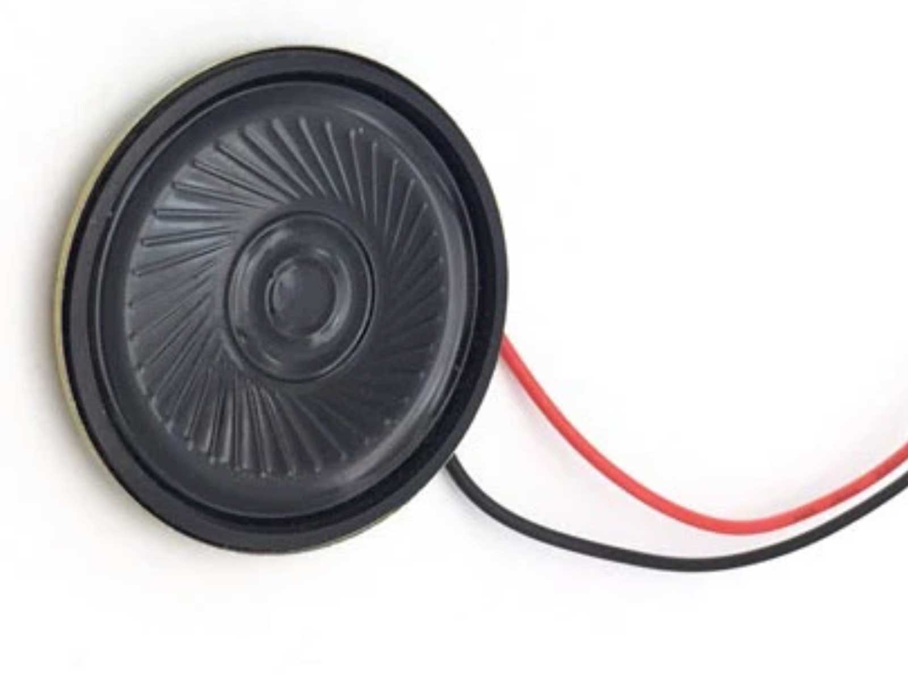
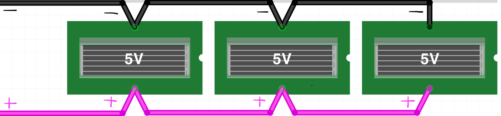
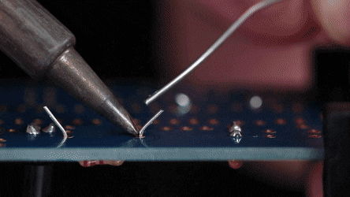

# Age of Dust - H&D Summer Camp

## Introduction

[text juliette]

## Workshop program

10.00 - 11.30 story & worldbuilding

11.30 - 13.00 imagining communication tools through low-fi making (e.g. paper mache). 

13.00 - 14.00 lunch break

14.00 - 15.30 building and connecting the electronics

15.30 - 17.30 LARPing together

17.30 - 18.00 reflections

## 1. Story & Worldbuilding

Relevant info and docs here: 

- Setting/context
- The three communities and their objectives
- Dependence on the sun/the body for energy
- [Something to introduce technical limitations (10 sec sound recording & playback) in a conceptual way?]
- Documenting

## 2. Imagining tools

Prompt: gather with the "community" you will be playing (4-7 people per group) and imagine an object that acts as a tool for your community and its objectives and values. Make a low-fidelity prototype using materials provided.  

* **values and objectives**: what are your communities' objectives and values within the story/world? How can a communication tool support these goals and values? 
* **knowledge**: how would your community define knowledge? What form does information take in this context, and how could it be protected/shared/practiced by the community?
* **interaction**: how is the tool "activated? Using hands/feet/nose/instrument? Individually or together?
* **position of the tool**: does it have a static position in the world, or is it mobile? Who carries it? How is it positioned on the body? Carried by individuals or in groups? How is the position of the tool related to its function/value/role for the group?
* **rituals**: are there any rituals in place around the use of the tool? who gets to use it? for what? How does decisionmaking take place? 
* **shape, size, texture**: following the points above, what should the tool look like?

## 3. Electronics

Bring your prototype to life! 

### Recording module ISD1820

The ISD1820 is a 10 second audio recording and playback module € 3.50 [Via tinytronics](https://www.tinytronics.nl/shop/en/audio/accessories/others/voice-recording-module-with-speaker-isd1820). The image explains the different pins and their uses. 

* [Datasheet](./files/VoiceRecord_moduleISD1820.pdf)
* Power consumption: up to 50mA during playback at 5V with sensor module as trigger
* All wiring diagrams for the different options discussed below are shown in this PDF under Files [./files > ISD1820_wiring.pdf](./files/ISD1820_wiring.pdf) 
* Every new recording overwrites the previous recording

  

### Sound outputs

You can connect different speakers to the board. Each of these can work on a sunny day with the solar panels provided. 

  

* **Piezo transducer**: press against your cheekbone/jaw to hear sound or place on a flat surface, e.g. wood. The consumption is only 15mA so it will work in most conditions, but the sound is also very low. You have to get close :)  ([LF-W50E10B-C](https://www.conrad.de/de/p/tru-components-717770-piezokeramisches-element-spannung-30-v-1-st-1566917.html)) 

 

* **8ohm/0.5W speaker**: the power consumption is a bit higher (up to 50mA) but you will hear the sound without having to get very close ([ekulit LSM-50F](https://www.reichelt.nl/nl/nl/miniatuur-luidspreker-0-2w-8-ohm-50mm-bl-50-p5631.html?search=ekulit+lsm-50F&&r=1))

 

* **8ohm/1W bone conductor transducer**. Turns any object into a loudspeaker. Is quite loud so consumption is higher: up to 65mA. This speaker doesn't work in all lighting conditions [tinytronics](https://www.tinytronics.nl/shop/en/audio/speakers/speakers/bone-conductor-transducer-8%CF%89-1w).
 

### Switches to make recording and/or trigger playback

Options for prefab sensor/switch modules are listed in this wiring pdf: 
[./files > ISD1820_wiring.pdf](./files/ISD1820_wiring.pdf) 

Want to make your own switch? 
You can work with any conductive material to make one (copper tape, aluminum foil, conductive ink and yarns, metal objects, moist objects, water. This document shows some examples for making your own switches: [./files > diyswitches.pdf](./files/diyswitches.pdf) 

  

### Power

The electronics setups listed here require 3-3V - 5V power supply. We've provided solar cells with a 5V rating. In order to get enough current to power the different components (at least 50mA) you will need to connect 2 or 3 solar cells *in parallel*. That way the voltage stays the same (5V), but the current of the cells adds up. 

  

### How to (de)solder

**Soldering**

A common mistake is to think of solder as hotglue (where you heat the glue and place it on the two elements you want to join). With soldering, you don't heat the solder. You heat the two elements you want to join for a couple seconds, and then you bring in the soldering tin. THe heat of the metal will make the solder flow into place. 

The process goes in four steps and takes only a few seconds.  

Preheat the soldering iron to 340 Celcius. Place the soldering iron onto the two elements you want to join. Keep it in place: 

1. Wait for the elements to heat for 2 seconds or so
2. Bring the solder in contact with the heated elements, if hot enough it melts
3. Remove the solder, but keep iron in place for 2 more seconds so it can flow across the metal parts
4. Remove the soldering iron so the metal can cool

 

**soldering two wires together**

This can be a bit tricky! Take a look at this video for a demonstration of how to do this [https://youtu.be/NSqPHQ1zQco](https://youtu.be/NSqPHQ1zQco)

**Desoldering with a braid**

Place the braid on top of the joint you want to desolder and place the soldering iron against the braid to heat it. The heat will draw the soldering tin from the joint into the braid, releasing the connection. Never pull at components: you can rip off the copper from the PCB board. If legs are still stuck, try to desolder more or heat the component while removing it. 

 

## 4. How to play

[instructions Juliette]
