# Age of Dust

Research for age of dust tools as part of worldbuilding workshops, by Loes and Emma, for Juliette!

## Requirements

* record and playback audio (both single track that overwrites, and multiple that are stored and can be played later)
* freedom in designing the interaction with the tool and how it looks
	* no-coding options will help with this
* possibility to recycle hardware parts (e.g. dynamos, switches)
* walkie-talkie-like system would be nice! 
* Number of workshop participants: 10-20 working in pairs
* Budget: max € 750 for all materials, components, tools

## Workflow

* Research some options to make sure things work together, based on wishes
* Document some examples for participants on how things work/connect
* The actual exploration - building tools for the script - will happen in the workshop

## Latest updates - 5 june

* direct powering ISD voice recording device with solar cells and triggering it w sensor module can be done w 2 cells and also works inside in direct sunlight. 
* powering mp3 player AND microcontroller AND speaker directly w solar seems feasible with 2-3X 5-6V cells in direct sun outside (not inside). Didn't add sensor module yet.. Really on the boundary though. Need to test some things again, ordered additional [5V solar cells](https://www.tinytronics.nl/shop/nl/power/zonne-energie/zonnepanelen/zonnepaneel-5v-200ma-110x80mm) to try 3 cell set-up. 
* Also ordered this regulated big one 5V/1A, worth a try [via TinyTronics](https://www.tinytronics.nl/shop/nl/power/zonne-energie/zonnepanelen/zonnepaneel-met-dc-dc-converter-en-usb-5v-1a)
* Bone conductor draws too much for 2x 5-6V cells when used in full set up with the other components. Better results w piezo and mini 8 ohm speaker. Will try again with additional solar cells mentioned above. Might need 4 but didn't have 4 identical ones.
* dynamos seem to need really high RPM to reach 6V, need setup w a bicycle wheel or belt system and pully. 
* couldn't get esp32 to work, attiny and digispark are fine. 
* Suggest to settle on the digispark as controller because it has integrated programmer and 5V/500mA regulator.

## To Do 

* power DFplayer directly w solar panel test > only in direct sun outside
* power walkie talkie directly w solar panel test 
* make dynamo power circuit > didn't do yet bcs can only get 1.5V from dynamo so far.
* study different dynamos (how to connect) > DONE
* design mechanism to turn dynamo fast > asked Heerko
* (emma) play/pauze functionality DF player

#### ISD1820:

* ISD1820 all options, input and output (all wiring diagrams) See here [./files > ISD1820_wiring.pptx](./files/ISD1820_wiring.pptx)
* power consumption: up to 50mA during playback at 5V with sensor module as trigger

#### DF MP3 player:
* Controlling DF player w resistors needs to be quite precise to get all buttons to play different track. I need to look into this a bit more to see which work well with (a combination of) standard resistors. 
	* Could be smart to figure out how to control with an ESP32 wroom devkit? (we have a bunch of those and they're cheap, looks like is possible). Can be controlled via UART (e.g. Arduino UNO, but have also seen [examples with ESP32](https://youtu.be/kq2RLz65_w0), which we have few of at H&D? Looked into ATtiny85 digispark a bit, [could work](https://github.com/wagiminator/ATtiny85-TinyDFPlayer) with some tuning of the internal oscillator, but not super easy I guess.

To do:

* right resistors selection for trigger different tracks
* check mp3 module with ESP32 wroom devkit - DIDNT WORK
* check mp3 module with attiny85 - WORKS - (need programmer)
* check mp3 module with digispark - WORKS (no programmer needed!)

## Audio in: recording & playback

### MP3 player €7.50

You can play the audio tracks saved in an SD card. You can trigger the different tracks by attaching switches/buttons to the different pins. You can customize the button and the speakers. See below.

[Via tinytronics](https://www.tinytronics.nl/shop/en/audio/audio-sources/dfrobot-dfplayer-mini-mp3-module)

[Documentation](https://wiki.dfrobot.com/DFPlayer_Mini_SKU_DFR0299)

Upside:

* can be triggered w resistors + switch combos, no microcontroller
* can be controlled via UART (e.g. Arduino UNO, but have also seen [examples with ESP32](https://youtu.be/kq2RLz65_w0), which we have few of at H&D? Looked into ATtiny85 digispark a bit, [could work](https://github.com/wagiminator/ATtiny85-TinyDFPlayer) with some tuning of the internal oscillator, but not super easy I guess.

Downside: 

* not typical values so need to do series of several resistors, not super stable it seems you need exactly the right value. I could make some pins work, but not all. Maybe a few is enough.
* controlling via ESP32 requires coding, but if we figure our how should be a huge problem to include. Some ppl will enjoy having the possibility of playing with a microcontroller as well if well-documented :) 

  

 *Below: diagram for controlling DFplayer with switches and resistors (as standalone module)*

  

#### MP3 player and Attiny85 >> CHECKED

 **Code for ATtiny**: [Play track for 10 sec, then move to next](./codes/attiny85_dfplayer/attiny85_dfplayer.ino)

* Hook-up guide to program the ATtiny chip with a programmer stick [here](https://learn.sparkfun.com/tutorials/tiny-avr-programmer-hookup-guide/)
 
* Hook-up guide to program the ATtiny chip with an arduino UNO [here](https://circuitdigest.com/microcontroller-projects/programming-attiny85-microcontroller-ic-using-arduino)

* Video of check: [./images/attiny_dfplayer_demo.mp4](./images/attiny_dfplayer_demo.mp4)

* Downsides: 
	* need a separate programmer (e.g. uno or programmer stick). More efficient to use digispark boards although they are more expensive that ATtiny. 
	* no on-board regulator (digispark does have)
 
  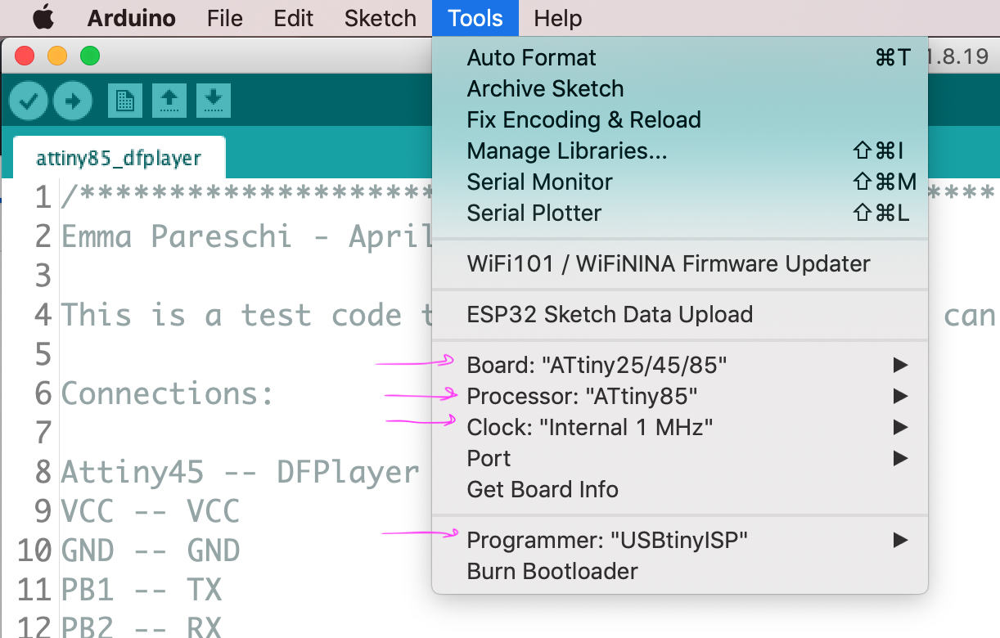 
 
 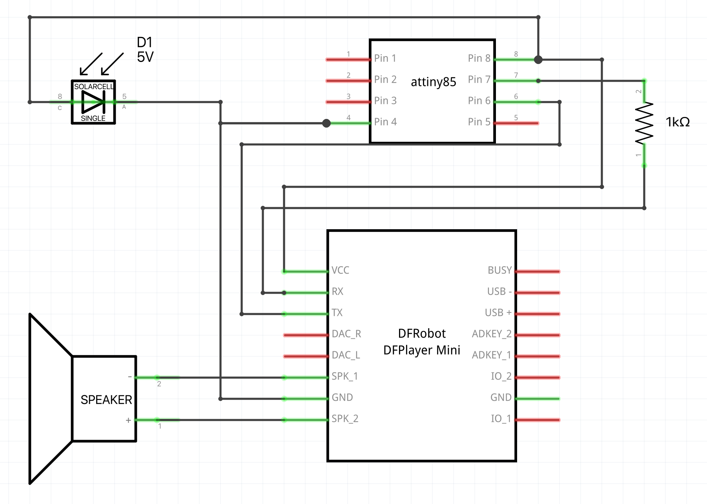 

 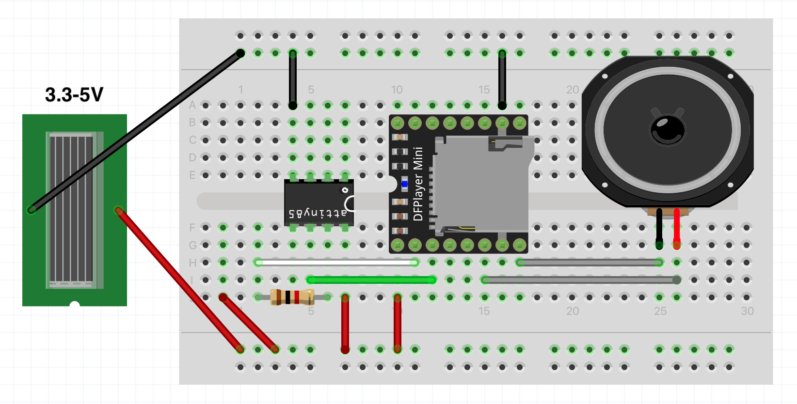 
 
 
 
#### MP3 player and DigiSpark board >> CHECKED
 
The Digispark is also an ATtiny based board but with an integrated programmer (Micronucleus). BONUS: you don't need a separate programmer board to upload the code. BONUS2: has an on-board 5V regulator that can switch 7-12V/500mA
 
Go through the installation instructions [here](http://digistump.com/wiki/digispark/tutorials/connecting) to get all dependencies. 
 
NOTE: you only plug in this board after you hit the upload button :) Read above tutorial for all differences.

NOTE: I needed to use a USB-hub to upload the code, it couldn't find the board without. 
 
NOTE ON CODE: you need to include the Digispark SoftSerial library in the sketch (different than the one above). I believe it comes along when you install the digispark boards. 

 **Code for DigiSpark**: [Play track for 10 sec, then move to next](./codes/digispark_dfPlayer/digispark_dfPlayer.ino)
 
  **Code for DigiSpark - NOT CHECKED!**: [Use trigger/switch to play 10 secs of the next song in the folder](./codes/digispark_dfPlayer_switch/digispark_dfPlayer_switch.ino)

 
 

 
#### MP3 player and DOIT esp32 DEVKIT >> DIDNT WORK

**note loes: not sure why, but the player didnt wanna play anything. Also: the esp32 operates between 2.2-3.6V so with the other stuff we'll be adding we might be better off opting for the digispark / attiny85 1.8-5.5V.**
 

 
Code: [One song play](./codes/doit_esp32_dev_dfplayer/doit_esp32_dev_dfplayer.ino)
 
 
 **Notes on filenames**
 
The folder name needs to be mp3, placed under the SD card root directory, and the mp3 file name needs to be 4 digits, for example, "0001.mp3", placed under the mp3 folder. Like so: 

 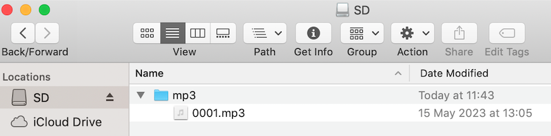 

 
 **Current consumption**
 
 The current consumption mostly depends on the volume. The volume can be set either in the code or with a switch connected to pin IO2/GND., long press increases the volume. The volume depends also on the mp3 file.
—> current consumption testes: 200mA / 500mA.

 **Power it**
 
 * usb cable (5V)
 * Vin pin, 5V up to 7V (maybe 12V)

### ISD1820 Voice recording module

ISD1820 - 10 second audio recording and playback module € 3.50 

Recording time can be adjusted to 20 secs by replacing jumper with a 200K resistor 
[Sound clip of distortion here](./files/ISD1820_pot_distort.mp3)

[Via tinytronics](https://www.tinytronics.nl/shop/en/audio/accessories/others/voice-recording-module-with-speaker-isd1820)

[Datasheet](./files/VoiceRecord_moduleISD1820.pdf)

[**All wiring diagrams** in files > ISD1820_wiring.pptx](./files/ISD1820_wiring.pptx)

**Power consumption during playback at 5V with tilt switch module as trigger:**

* up to 50mA with 8ohm/0.5W speaker as output ([ekulit LSM-50F](https://www.reichelt.nl/nl/nl/miniatuur-luidspreker-0-2w-8-ohm-50mm-bl-50-p5631.html?search=ekulit+lsm-50F&&r=1))
* up to 15mA with 800ohm piezo disk as output ([LF-W50E10B-C](https://www.conrad.de/de/p/tru-components-717770-piezokeramisches-element-spannung-30-v-1-st-1566917.html))
* up to 65mA with 8ohm/1W [bone conductor transducer](https://www.tinytronics.nl/shop/en/audio/speakers/speakers/bone-conductor-transducer-8%CF%89-1w) as output

  
 
**Can NOT be customized:**

* core pcb

**Can maybe be customized: >> didnt try**

* embedded mic

**Can be customized: >> see image**

* the speaker (works w. piezo, bone conductor, jack to batt powered speaker)
* the buttons (vcc <-> play)
* samplerate with 500k pot on p2 jumper (distorts sounds)
* slide switch to loop
* slide switch to drive speaker directly

**Limitations:** 

* Only one file can be stored and played on this device.
* Built-in amp very low. You can attach a jack to the speaker pins and connect to battery powered speaker though, or connect a stronger amplifier (see below).

## Audio out: Speakers

### battery powered speakers 

Anything that takes a jack

  

### piezo transducer 

€0.50 [via tinytronics](https://www.tinytronics.nl/shop/en/audio/speakers/buzzers/piezo-electronic-buzzer-with-soldered-wires-35mm) placing it between teeth or on jaw makes sound audible

  

### bone conductor transducer 

turns any surface into a speaker € 5 [via tinytronics](https://www.tinytronics.nl/shop/en/audio/speakers/speakers/bone-conductor-transducer-8%CF%89-1w), [via Adafruit](https://www.instructables.com/Adafruit-Bone-Conduction-Speaker/)

 
 
### DIY speakers
 
a little bit elaborated, you need different materials [see Kobakant for inspiration](https://www.kobakant.at/DIY/?p=5935). Here a [tutorial for a soft speaker](https://www.instructables.com/Woven-Paper-Cup-Speaker/) made with yarn in a paper cup, and [here how to make a coil from lacquered wire](https://www.instructables.com/How-to-make-a-speaker-4/). A speaker works with electromagnetism. It consists of a coil (an insulated spiral of conductive material), a strong magnet, and a cone or other thin membrane. When there's a current going through the coil and the magnet is close enough, it will start to move slightly at a very fast speed (frequency), the movement is transferred to the membrane or cone attached to it, which amplifies it acoustically so the sound becomes audible.

  

*Note: this may take some trial and error process to get right :)*

* for the coil: lacquered copper wire, copper tape, conductive yarn and regular yarn. Make a coil that measures 4-8 ohm resistance. Tighter windings = louder sound
* don't short the coil 
* you need to make a cone or membrane, e.g. from paper, fabrics, paper/plastic cups. Should be stiff-ish but not too stiff (then the small vibrations can't move the cone/membrane).
* insulation tape
* strong neodymium magnets 
* connect the wires of the speaker in the same place you would the other speakers, move one or more magnets closer to the coil to activate the speaker

  
 
 *Credit: Kobakant*

 
### Amplifier 

You can get louder sound out of these devices with an additional amplifier, E.g. **Velleman PMK190** €10,50 [via Soldeerboutshop](https://www.soldeerbout-shop.nl/zelfbouw-kits/390-velleman-mk190-mp3-speler-audio-versterker-2x-5watt-mini-kits-bouwpakket-5410329450168.html) or [via Display Elektronica](https://display-elektronica.nl/Webwinkel-Product-201167391/MK190-2X5W-VERSTERKER-VOOR-MP3-SPELER.html)

*Note: this amp has a 3.5mm jack chassis for audio in (so you need a solderable jack plug to connect it).*

For wiring diagram is see here [./files > ISD1820_wiring.pptx](./files/ISD1820_wiring.pptx)

  
 
 
## Triggers: switches

You can make your digital sensor or use already made digital sensors. The options below are plug and play without coding or breadboard (just jumpers/alligator clips). The pre-assembled boards allow you to calibrate an analog sensor as switch (e.g. light sensor), by turning the screw on the board. You can also use any on/off switches you salvage from old devices and use them as a trigger

Some DIY switch examples here [./switches/diyswitches.md](./switches/diyswitches.md)

### any metal/conductive parts 

Aluminum foil, copper tape, metals, wet materials. See also this page with examples: [DIY switches page](./switches/diyswitches.md)

  

### piezo transducer 

€0.50 [via tinytronics](https://www.tinytronics.nl/shop/en/audio/speakers/buzzers/piezo-electronic-buzzer-with-soldered-wires-35mm) press, knock or bend to create trigger signal.

  

### vibration sensor module 

€ 2 [via tinytronics](https://www.tinytronics.nl/shop/en/sensors/acceleration-rotation/vibration-sensor-module-3-5v-sw-18010p)

  

### tilt sensor 

€ 2 [via tinytronics](https://www.tinytronics.nl/shop/en/sensors/acceleration-rotation/ball-switch-tilt-sensor-module-3-5v-sw-520d)

  

### magnet sensor 

€ 1,50 [via tinytronics](https://www.tinytronics.nl/shop/en/sensors/magnetic-field/hall-effect-switch-module)

  

### motion sensor 

€ 3,50 [via tinytronics](https://www.tinytronics.nl/shop/en/sensors/motion/ir-pyroelectric-infrared-pir-motion-sensing-detector-module)

>> can be hard to control, bit flimsy

  

### light sensor 

€ 2,50 [via tinytronics](https://www.tinytronics.nl/shop/en/sensors/optical/light-and-color/light-sensor-module)

  

### red laser sensor 

€ 2 [via tinytronics](https://www.tinytronics.nl/shop/en/sensors/
optical/light-and-color/red-laser-sensor-module)

 

## Output: Other than sound

WIP

### Piezo mist discs 

€ 0,80 standalone, [via tinytronics](https://www.tinytronics.nl/shop/en/mechanics-and-actuators/others/piezo-mist-disc-110khz) or module € 4 [via tinytronics](https://www.tinytronics.nl/shop/en/mechanics-and-actuators/others/ultrasonic-mist-module)

  

### red laser 

€ 2 [via tinytronics](https://www.tinytronics.nl/shop/en/sensors/optical/light-and-color/red-laser-sensor-module) >> omg check [this DIY laser projection generated by sound and mirrors](https://www.kobakant.at/DIY/?p=9106)

  
 

## Messaging: walkie talkies

Now ordered these walkie talkies to open up, € 29.99 [via LIDL](https://www.lidl.nl/p/silvercrest-walkie-talkies-voor-kinderen/p100359077002?mktc=shopping)

These have 8 channels to choose from, volume control, and - yess - a mic. Sound quality is not bad! Also has an LED number panel that indicates the selected channel. The channels probably mean we can also have more than 2 walkie talkies transmitting on that frequency. 

Opens up by loosening the screws, just need to cut into silicone that glues down the speaker to remove it. Circles in the PCB show where the buttons were located. Other switches can be attached with some precision soldering and a dot of hot glue.

**Can be customized?**

* switches > YES
* microphone > YES
* LED number > only externally I think? E.g. make a lamp cover LOL
* speaker > YES
* 4.5V power supply > also ok at 5V?
	* **250mA when receiving** (bench supply stays at 5V) [see video](./files/receive.mp4)
	* **400mA when sending!** (my bench supply drops to 4.5V) [see video](./files/send.mp4)

  

 *walkie talkies unharmed*

   
 
 *opening up walkie talkie: carefully cut loose silicon that keeps speaker in place*

   

   *power connections and speaker connector*
  
   

   *switches and other components on reverse*
   
**Soldering leads to the button connectors**

This took me an hour and a half, it's quire a surgeon's job. But it still works! How I did it: 

* soldering tip: small tip with a flat edge
* keep desoldering braid at hand for mistakes
* use insulation tape as masking tape, so only the part you want to solder is free
* put a teeny tiny drop of solder where you want to connect the jumper
* strip 1 cm of your wire
* take two strands from the jumper wire, cut the rest short
* twist the two strands and tin them with solder
* cut them down to 3-4 mm (don't do as I did in the pics! you will short stuff)
* solder the two copper hairs to the pad
* do the same with the other part of the switch
* check with the multimeter if the wires are properly connected and not shorted
* keep in place with a dollop of hot glue
* tape the wire pairs for each switch together with tape, for easy reference

	 

	*masked the traces so only the tiny part to solder is naked*

	 

	*very proud, this was harrrrd*
	
	 
	
	*wasn't too stingy with the hotglue, but had to be careful not to break wires*

## Power supplies - tests

### Voice recorder module + tilt switch module

I tested some configurations of the solar panels with the IDS1820 module, a tilt switch, and the bone conductor transducer. 

|     **IDS1820 + tilt switch + ...**    | Image                                                                                        | Type                                                                                                                                                                                        | Config   | Voltage | Max current | Inside, shadow (sunny day) | Inside direct sun | Outside, shadow (sunny day) | Outside, direct sun | Videos                                                                                                                                                   |
|---------|----------------------------------------------------------------------------------------------|---------------------------------------------------------------------------------------------------------------------------------------------------------------------------------------------|----------|---------|-------------|----------------|-------------------|-----------------|---------------------|----------------------------------------------------------------------------------------------------------------------------------------------------------|
| 2x 2V   | 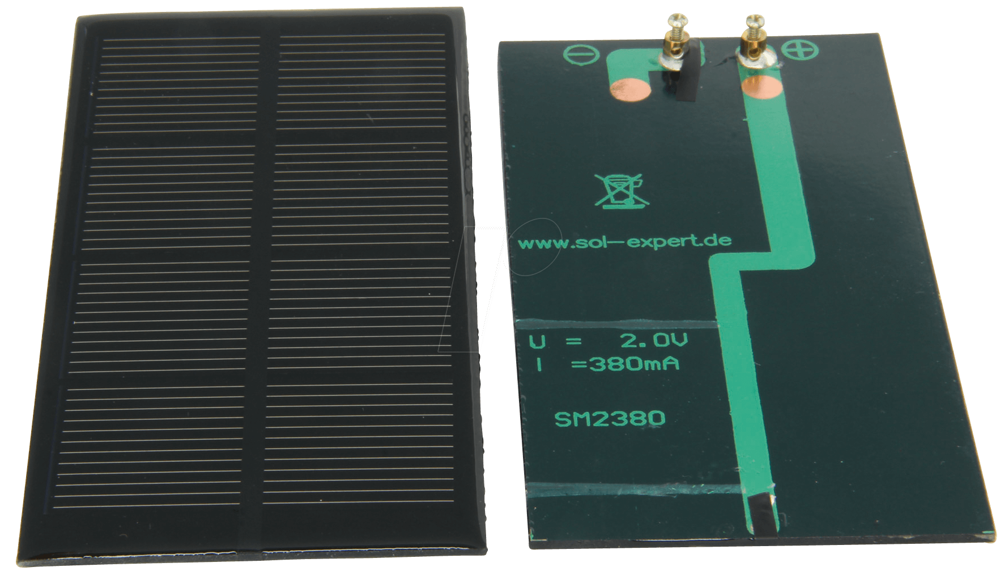   | [Solar SM2380 - 2V/380mA - via Reichelt](https://www.reichelt.nl/nl/nl/vergoten-zonnecel-2-v-380-ma-solar-sm2380-p159957.html?&nbc=1)                                                       | Series   | 4V      | 380mA       | NO             | YES               | YES (lower)     | YES                 | [./images/2cells_inside_IDSmodule_tilt.mp4]() [./images/2x2Vcells_outside_IDSmodule_tilt.mp4]() [./images/2x2Vcells_outside_IDSmodule_tilt_coverd.mp4]() |
| 3x 2V   |    | [Solar SM2380 - 2V/380mA - via Reichelt](https://www.reichelt.nl/nl/nl/vergoten-zonnecel-2-v-380-ma-solar-sm2380-p159957.html?&nbc=1)                                                       | Series   | 6V      | 380mA       | NO             | YES               | YES (lower)     | YES                 | [.images/3cells_inside_IDSmodule_tilt.mp4]()                                                                                                             |
| 1x 6V   | 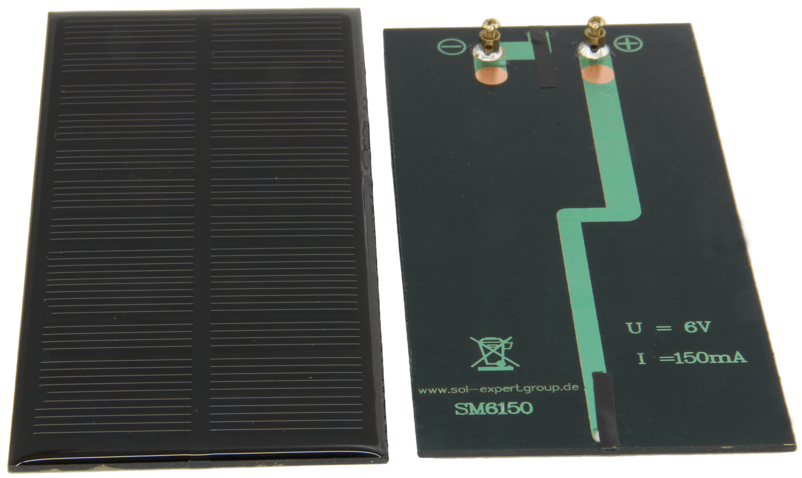   | [Solar SM6150 - 6V/150mA - via Reichelt](https://www.reichelt.nl/nl/nl/vergoten-zonnecel-6-v-150-ma-solar-sm6150-p159960.html?&nbc=1)                                                       | n/a      | 6V      | 150mA       | NO             | YES               | YES (lower)     | YES                 | [./images/1cell_6V_outside.mp4]()                                                                                                                        |
| 2x 6V   |    | [Solar SM6150 - 6V/150mA - via Reichelt](https://www.reichelt.nl/nl/nl/vergoten-zonnecel-6-v-150-ma-solar-sm6150-p159960.html?&nbc=1)                                                       | Parallel | 6V      | 300mA       | NO             | YES               | YES (lower)     | YES                 | [./images/2cells_inside_IDSmodule_tilt.mp4]() [./images/2x6Vcells_outside_IDSmodule_tilt_coverd.mp4]()                                                   |
| 1x 5.5V | 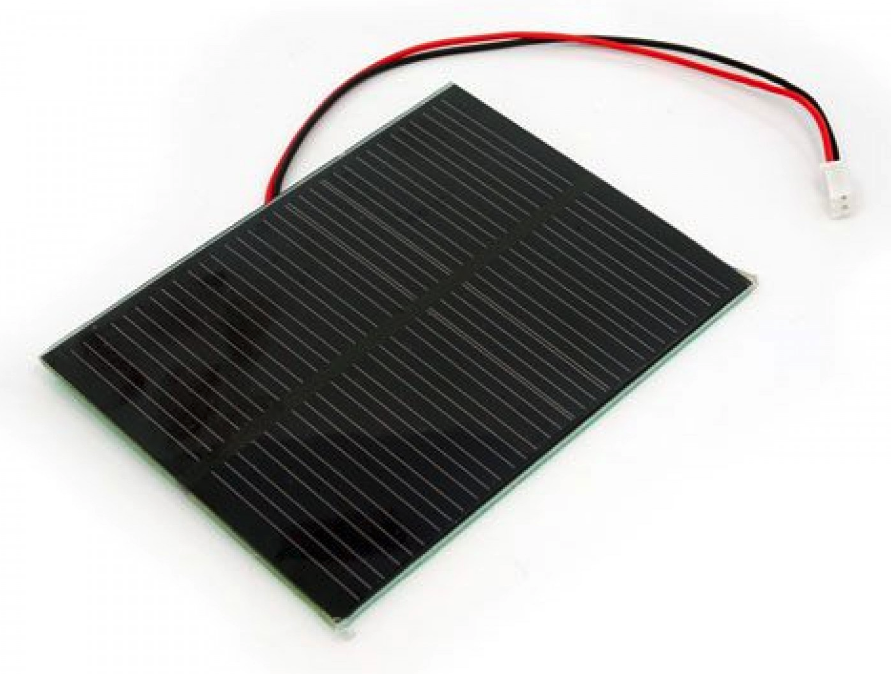 | [Seeed Studio Zonnepaneel 5V5/100mA via Tinytronics](https://www.tinytronics.nl/shop/nl/power/zonne-energie/zonnepanelen/seeed-studio-zonnepaneel-5.5v-170ma-80x100mm-met-jst-ph-connector) | n/a      | 5.5V    | 170mA       | NO             | YES               | YES (lower)     | YES                 |                                                                                                                                                          |
| 2x 5.5V |  | [Seeed Studio Zonnepaneel 5V5/100mA via Tinytronics](https://www.tinytronics.nl/shop/nl/power/zonne-energie/zonnepanelen/seeed-studio-zonnepaneel-5.5v-170ma-80x100mm-met-jst-ph-connector) | Parallel | 5.5V    | 340mA       | NO             | YES               | YES (lower)     | YES                 | [./images/2x5V5cells_outside_IDSmodule_tilt.mp4]()                                                                                                       |

### DFplayer + ATtiny85 + speakers 

I have to redo these tests because my notes were terrible and I didn't have a switch module connected. But first impression is that powering both the mp3 player and driving a bone conductor transducer speaker is a bit two much for 1-2 cells. Better results with the piezo transducer and a regular tiny 8 ohm speaker. All of these only worked outside and in direct sunlight. Not in the shadow, not inside.

### Solar panels test

 
  
   
    
  
with the use of a DC-DC converter, € 3 [via TinyTronics](https://www.tinytronics.nl/shop/en/power/voltage-converters/buck-(step-down)-converters/dc-dc-ajustable-step-down-buck-converter-lm2596-3a), you can power directly the board, without battery.

>> Video to understand boost and buck converters and how to calculate : [https://youtu.be/9--_jaxiXhE](https://youtu.be/9--_jaxiXhE)

>> Datasheet of LM2596 chip on the buck converter above [./datasheets/LM2596chip-on-buck-conv.pdf](./datasheets/LM2596chip-on-buck-conv.pdf) 

>> From what I understand if the Vin from the solar cell drops too low (<4V) this could blow the circuit because it will draw too much current? 

>> The datasheet mentions the option of an undervoltage lockout circuit but i can't tell if the module tinytronics sells has this or whether we can add it on. Undervoltage lockout monitors Vin: if it's too low it will not switch on, only when its high enough?

**Solar readings**

For Seeed Studio Solar panels 5.5V 100mA - 55x70mm with JST-PH connector €4,25 [via Tinytronics](https://www.tinytronics.nl/shop/nl/power/zonne-energie/zonnepanelen/seeed-studio-zonnepaneel-5.5v-100ma-55x70mm-met-jst-ph-connector)

I didn't try outside on a sunny day yet (it hasn't been sunny). As single cell I don't think these will do eh? Need something that outputs >5V in dark-ish conditions I guess? Maybe more like this? [https://www.tinytronics.nl/shop/en/power/solar-energy/solar-panels/solar-panel-with-dc-dc-converter-and-usb-5v-1a](https://www.tinytronics.nl/shop/en/power/solar-energy/solar-panels/solar-panel-with-dc-dc-converter-and-usb-5v-1a)

* Dark corner inside: 1.25V
* Inside the house during day: 2.2V
* Covered w hand in the window: 2.35V
* Dark corner, with LED light: 3.8V
* In the window (overcast day): 4.9V
* Outside in the sun: ??

 
 
  

  
  
   

  

### DYNAMO powered

instructable: [https://waag.org/sites/waag/files/en-ditos-10-phone-lr.pdf](https://waag.org/sites/waag/files/en-ditos-10-phone-lr.pdf)

**Materials for DIY dynamo**

* New 6V dynamo at [Praxis](https://www.praxis.nl/tuin-buitenleven/fiets/fietsverlichting/dresco-dynamo-links-zwart-6v-3w/5599378?channable=02490e69640035353939333738d6#specs) €4 

* Second hand via Marktplaats. I got some old ones at a good price. They're all rated at 6V/3W. I tested the ones with an exposed nut on top (8mm and 9 mm) that I could drive with my IKEA battery powered hand drill. I got between 0.7 and 1.5V readings. I assume you need to make a lot more rotations per second to get the 5-6 V we need. Charging my drill now to see if there's a difference with a full battery. You can see video [here](./images/dynamotest_handdrill.mp4)

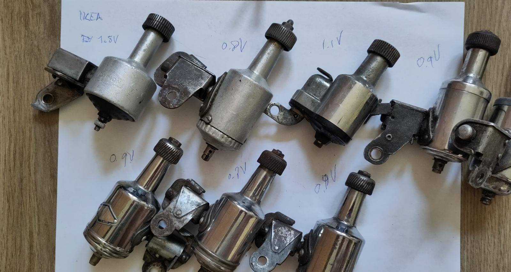

Most likely we need to make some kind of system to get more rotations. Either by mounting it on a stationary bike, like they did [here](https://www.lowtechmagazine.com/2022/03/how-to-build-bike-generator.html).

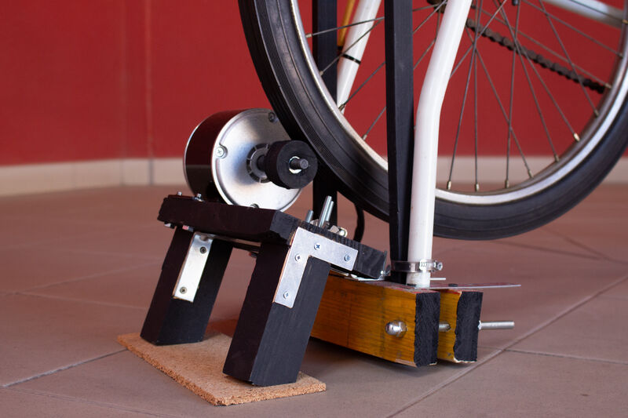

*Above: Low Tech Magazine's Household Bike Generator*

Or something similar to this (probably with a bigger wheel): 

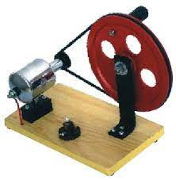

**Parts list for use with 6V/12V/24V (up to 26V) dynamos**

* Bridge rectifier (AC to DC) = [AM151](https://uk.farnell.com/multicomp/am151/bridge-rectifier-1-5a-100v/dp/9381430) or alternative [via Reichelt](https://www.reichelt.nl/nl/nl/bruggelijkrichter-400-v-1-5-a-b250c1500g-vis-p219410.html?&trstct=pol_11&nbc=1)
* Capacitor 1 = 2200uF electrolytic [via Reichelt](https://www.reichelt.nl/nl/nl/elko-radiaal-2200-f-25-v-105-c-16-x-25-mm-rm-7-5-muniti-rad-105-2-200-25-p42407.html?&trstct=pol_0&nbc=1)
* Capacitor 2 = 0.47uF tantalum [via Reichelt](https://www.reichelt.nl/nl/nl/tantaal-condensator-rm-2-5-0-47-f-35v-tantal-0-47-35-p20328.html?&nbc=1)
* Capacitor 3 = 22uF tantalum [via Reichelt](https://www.reichelt.nl/nl/nl/tantalkondensator-22-f-35-v-avx-tap226m035cc-p246462.html?&nbc=1)
* 5V regulator (converts 6V into 5V) [LM2940CT5 via Reichelt](https://www.reichelt.nl/nl/nl/spanningsregelaar-5-0v-1a-to-220-lm-2940-ct5-p39455.html?&nbc=1) But you are on the limit! Actually they recomend voltage input 7V. This regulator can be used also with a 12V dynamo.
* perfboard lanes [via Reichelt](https://www.reichelt.nl/nl/nl/bandroosterprintplaat-hardpapier-160x100mm-up-720hp-p23958.html?&nbc=1)

**@ EMMA: I've tried making a schematic and breadboarded version from the example and your info for the 6V/12V/24V option. I hope the color codes make legible a bit the thinking process. If you want to check the fritz for proper routing, the fritzing sketch is under Files > dynamo_v2_noresistors.fzz. _UPDATE_: I removed the resistors and made a version without bridge rectifier for the solar powered version.**

[OR just get experiment PCB lanes (continuous) at tinytronics €2 a pop](https://www.tinytronics.nl/shop/en/tools-and-mounting/prototyping-supplies/experiment-pcbs/experiment-pcb-9cm*15cm-lanes)

  
  
**Alternative: (only with 6V dynamos)**

* 5V output regulator, at least current from 0.5 up to 1.5A: the only one through hole I found in Fernel is MCP1826S-5002E/AB: [link](https://it.farnell.com/en-IT/microchip/mcp1826s-5002e-ab/ic-ldo-5-0v-1a-to-220-3/dp/1578425)
* Capacitor 3 (on output): 10uF (tantalum cap, orientation!)
* Capacitor 2 (on input): 4.7uF (Tantalum cap, orientation!)

  
### Solar powered AND regulated

The same circuit can be used with solar cells in series (totalling > 5V!) instead of a dynamo. In that case the bridge rectifier isn't needed because the solar panel already gives DC voltage.

**In series with 3x 2V/380mA solar cells**

This one assumes 3x the 2V/380mA solar cells, in series they would supply 6V/380mA. Let's see if this can power the different outputs. 

  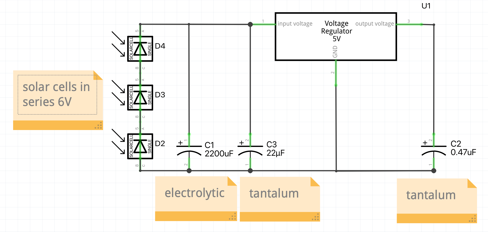

  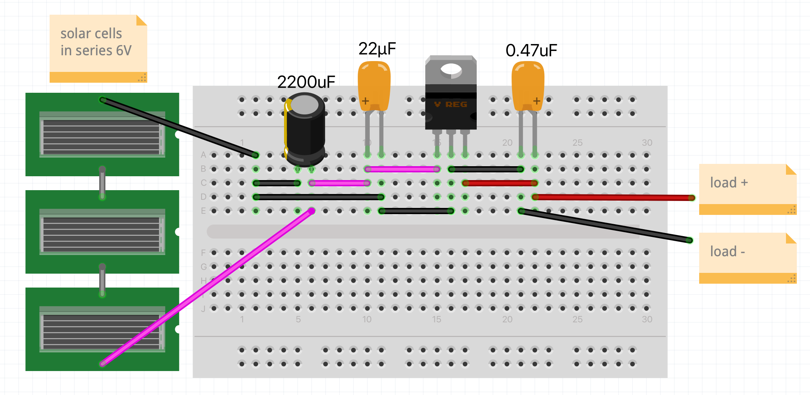

**In parallel with 3x 6V/150mA solar cells**

This one assumes 3x 6V/150mA solar cells. In parallel they would supply 6V/450mA.  Which should be enough for all our applications. 

  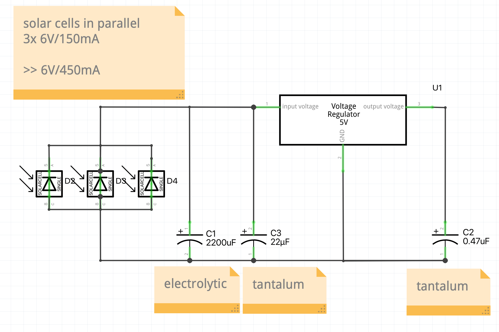

  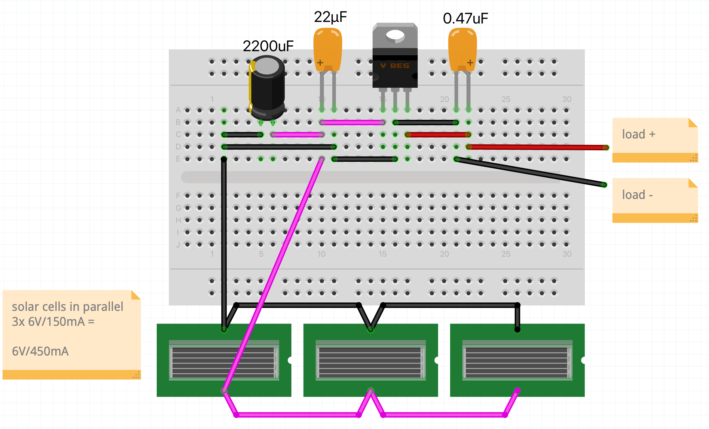

  
## Casing and integration

WIP
