# Age of Dust

Research for age of dust tools as part of worldbuilding.

## Wishes

* record and playback audio (both single track that overwrites, and multiple that are stored and can be played later)
* freedom in designing the interaction with the tool and how it looks
	* no-coding options will help with this
* possibility to recycle hardware parts
* walkie-talkie-like system could be fun 

## Update for Emma and questions

* Juliette and I love all these options and would like to offer them all :) <3
* Loud sound is not a must, Juliette is interested in a "different ways of listening" approach <3 <3
* DIY switch examples here [./switches/diyswitches.md](./switches/diyswitches.md)
* I added a solar power option at the bottom that we've used before, we have some of these in the studio, so might be worth taking a look? YES
* I found a nice walkie talkie option which I opened up, looks promising (see below)
* I listed all components in a spreadsheet with some info on operating voltages, supplier link and prices etc so we can keep track easily, see [files > components.xlsx](./files/components.xlsx). I also added some other options here that might be fun (in blue and red).

#### ISD1820:
* ISD1820 all options, input and output (all wiring diagrams) See here [./files > ISD1820_wiring.pptx](./files/ISD1820_wiring.pptx)
* power consumption: up to 50mA during playback at 5V with sensor module as trigger

To do:

* power source: 
 - check the spec of the solar panel kit.
 - add reference for dynamo charger
 - evalute wind turbine

#### DF MP3 player:
* Controlling DF player w resistors needs to be quite precise to get all buttons to play different track. I need to look into this a bit more to see which work well with (a combination of) standard resistors. 
	* Could be smart to figure out how to control with an ESP32 wroom devkit? (we have a bunch of those and they're cheap, looks like is possible). Can be controlled via UART (e.g. Arduino UNO, but have also seen [examples with ESP32](https://youtu.be/kq2RLz65_w0), which we have few of at H&D? Looked into ATtiny85 digispark a bit, [could work](https://github.com/wagiminator/ATtiny85-TinyDFPlayer) with some tuning of the internal oscillator, but not super easy I guess.

To do:

* right resistors selection for trigger different tracks
* check mp3 module with ESP32 wroom devkit - done
* check mp3 module with attiny85 - done

## Questions for Juliette

* how many participants are we thinking? > 10-20 working in pairs
* it could be cool to go [soft](https://www.kobakant.at/DIY/) (wearable props), but this is an entirely different making process. Could also be wearable but hard :)
* What kind of materials would you prefer for casings? Natural materials? Plastics? Recycled? Integrated into costume?

## Budget

Max € 750 for all materials, components, tools

## Workflow

* Research some options to make sure things work together, based on wishes
* Document some examples for participants on how things work/connect
* The actual exploration - building tools for the script - will happen in the workshop

## Audio in: recording & playback

### MP3 player €7.50

You can play the audio tracks saved in an SD card. You can trigger the different tracks by attaching switches/buttons to the different pins. You can customize the button and the speakers. See below.

[Via tinytronics](https://www.tinytronics.nl/shop/en/audio/audio-sources/dfrobot-dfplayer-mini-mp3-module)

[Documentation](https://wiki.dfrobot.com/DFPlayer_Mini_SKU_DFR0299)

Upside:

* can be triggered w resistors + switch combos, no microcontroller
* can be controlled via UART (e.g. Arduino UNO, but have also seen [examples with ESP32](https://youtu.be/kq2RLz65_w0), which we have few of at H&D? Looked into ATtiny85 digispark a bit, [could work](https://github.com/wagiminator/ATtiny85-TinyDFPlayer) with some tuning of the internal oscillator, but not super easy I guess.

Downside: 

* not typical values so need to do series of several resistors, not super stable it seems you need exactly the right value. I could make some pins work, but not all. Maybe a few is enough.
* controlling via ESP32 requires coding, but if we figure our how should be a huge problem to include. Some ppl will enjoy having the possibility of playing with a microcontroller as well if well-documented :) 

 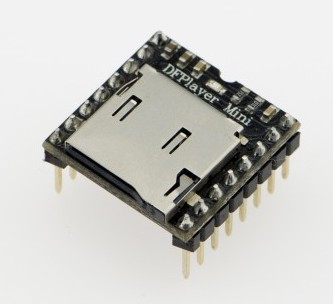 

 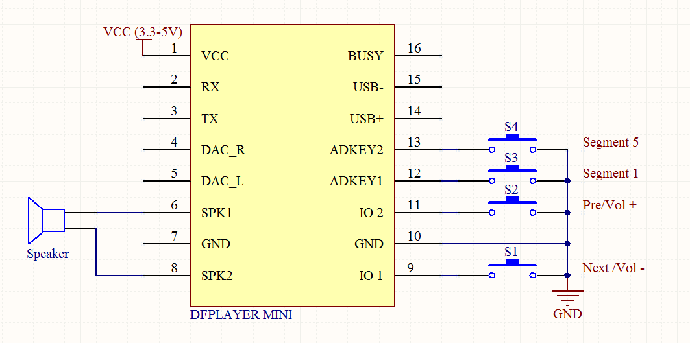 

#### MP3 player and Attiny85
 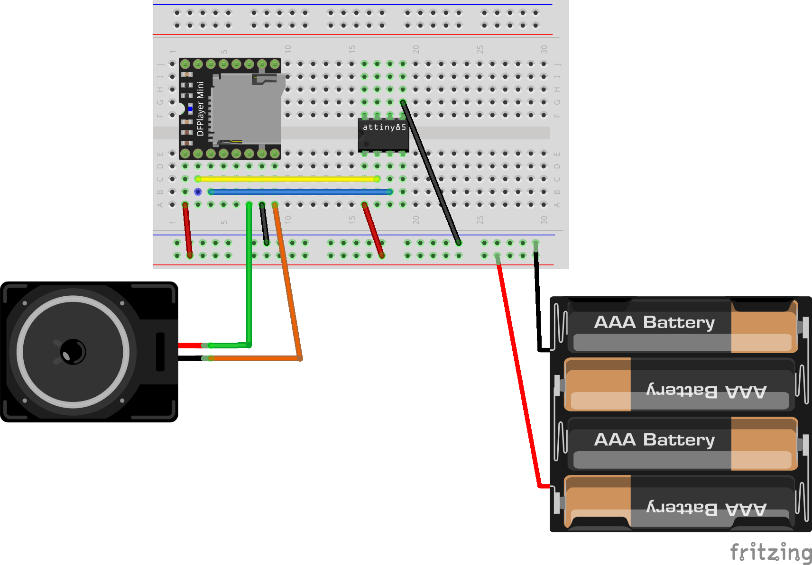 
 
 Code: [One song play for 10sec](./codes/attiny85_dfplayer/attiny85_dfplayer.ino)
 
 
 #### MP3 player and Digispark Attiny85
 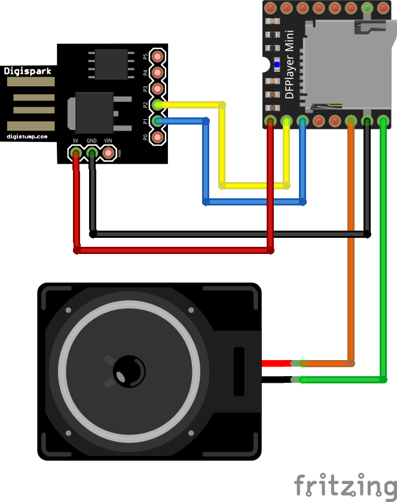 
 
 #### MP3 player and DOIT esp32 DEVKIT
 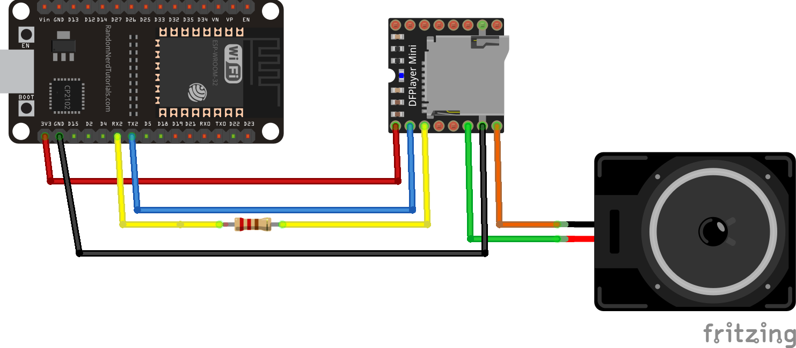
 
 Code: [One song play](./codes/doit_esp32_dev_dfplayer/doit_esp32_dev_dfplayer.ino)
 
 **Current consumption**
 The current consumption mostly depends on the volume. The volume can be set either in the code or with a switch connected to pin IO2/GND., long press increases the volume. The volume depends also on the mp3 file.
—> current consumption testes: 200mA / 500mA.

 **Power it**
 * usb cable (5V)
 * Vin pin, 5V up to 7V (maybe 12V)

### ISD1820 Voice recording module

ISD1820 - 10 second audio recording and playback module € 3.50 

Recording time can be adjusted to 20 secs by replacing jumper with a 200K resistor 
[Sound clip of distortion here](./files/ISD1820_pot_distort.mp3)

[Via tinytronics](https://www.tinytronics.nl/shop/en/audio/accessories/others/voice-recording-module-with-speaker-isd1820)

[Datasheet](./files/VoiceRecord_moduleISD1820.pdf)

[**All wiring diagrams** in files > ISD1820_wiring.pptx](./files/ISD1820_wiring.pptx)

**Power consumption during playback at 5V with tilt switch module as trigger:**

* up to 50mA with 8ohm/0.5W speaker as output ([ekulit LSM-50F](https://www.reichelt.nl/nl/nl/miniatuur-luidspreker-0-2w-8-ohm-50mm-bl-50-p5631.html?search=ekulit+lsm-50F&&r=1))
* up to 15mA with 800ohm piezo disk as output ([LF-W50E10B-C](https://www.conrad.de/de/p/tru-components-717770-piezokeramisches-element-spannung-30-v-1-st-1566917.html))
* up to 65mA with 8ohm/1W [bone conductor transducer](https://www.tinytronics.nl/shop/en/audio/speakers/speakers/bone-conductor-transducer-8%CF%89-1w) as output

 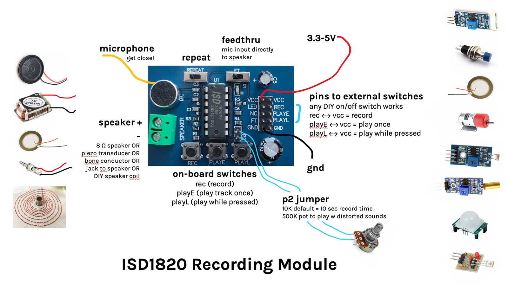 
 
**Can NOT be customized:**

* core pcb

**Can maybe be customized: >> didnt try**

* embedded mic

**Can be customized: >> see image**

* the speaker (works w. piezo, bone conductor, jack to batt powered speaker)
* the buttons (vcc <-> play)
* samplerate with 500k pot on p2 jumper (distorts sounds)
* slide switch to loop
* slide switch to drive speaker directly

**Limitations:** 

* Only one file can be stored and played on this device.
* Built-in amp very low. You can attach a jack to the speaker pins and connect to battery powered speaker though, or connect a stronger amplifier (see below).

## Audio out: Speakers

### battery powered speakers 

Anything that takes a jack

 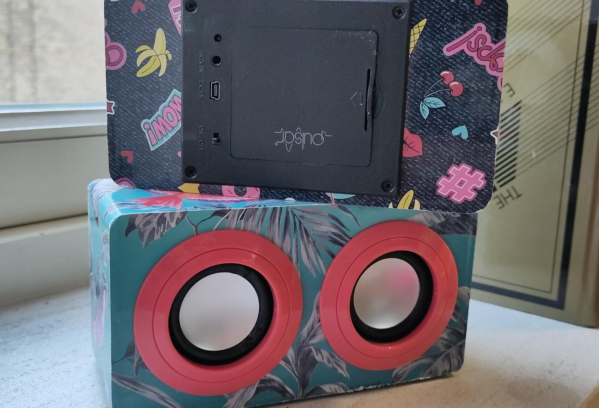 

### piezo transducer 

€0.50 [via tinytronics](https://www.tinytronics.nl/shop/en/audio/speakers/buzzers/piezo-electronic-buzzer-with-soldered-wires-35mm) placing it between teeth or on jaw makes sound audible

 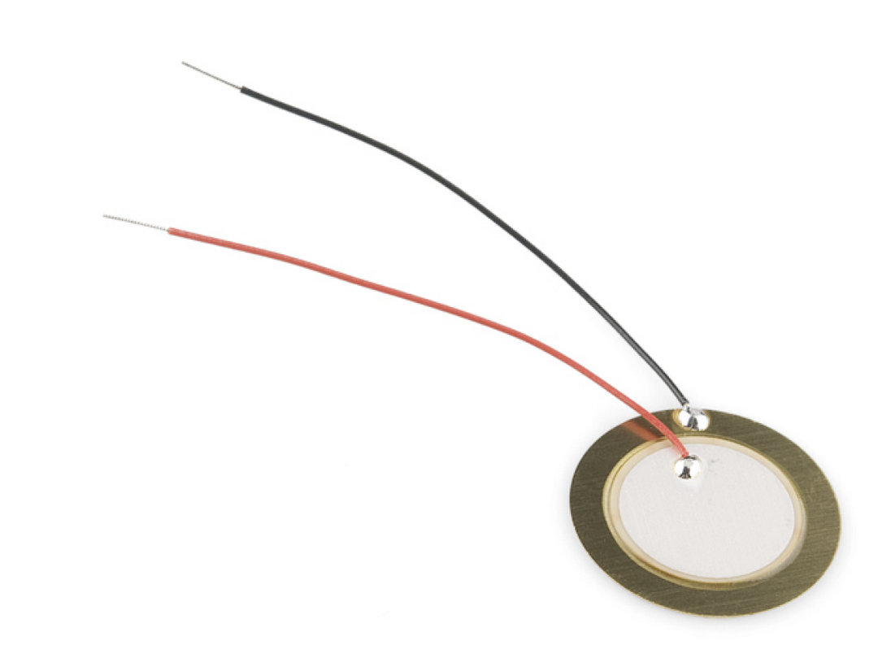 

### bone conductor transducer 

turns any surface into a speaker € 5 [via tinytronics](https://www.tinytronics.nl/shop/en/audio/speakers/speakers/bone-conductor-transducer-8%CF%89-1w), [via Adafruit](https://www.instructables.com/Adafruit-Bone-Conduction-Speaker/)

 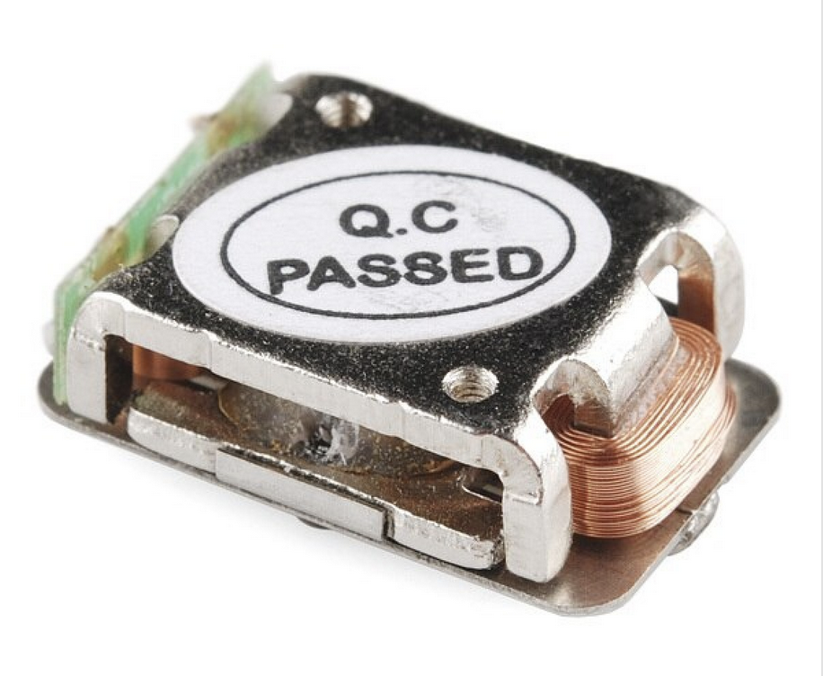
 
### DIY speakers
 
a little bit elaborated, you need different materials [see Kobakant for inspiration](https://www.kobakant.at/DIY/?p=5935). Here a [tutorial for a soft speaker](https://www.instructables.com/Woven-Paper-Cup-Speaker/) made with yarn in a paper cup, and [here how to make a coil from lacquered wire](https://www.instructables.com/How-to-make-a-speaker-4/). A speaker works with electromagnetism. It consists of a coil (an insulated spiral of conductive material), a strong magnet, and a cone or other thin membrane. When there's a current going through the coil and the magnet is close enough, it will start to move slightly at a very fast speed (frequency), the movement is transferred to the membrane or cone attached to it, which amplifies it acoustically so the sound becomes audible.

 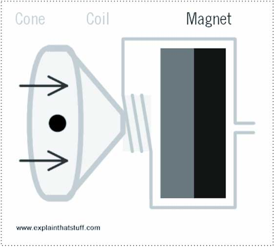 

*Note: this may take some trial and error process to get right :)*

* for the coil: lacquered copper wire, copper tape, conductive yarn and regular yarn. Make a coil that measures 4-8 ohm resistance. Tighter windings = louder sound
* don't short the coil 
* you need to make a cone or membrane, e.g. from paper, fabrics, paper/plastic cups. Should be stiff-ish but not too stiff (then the small vibrations can't move the cone/membrane).
* insulation tape
* strong neodymium magnets 
* connect the wires of the speaker in the same place you would the other speakers, move one or more magnets closer to the coil to activate the speaker

 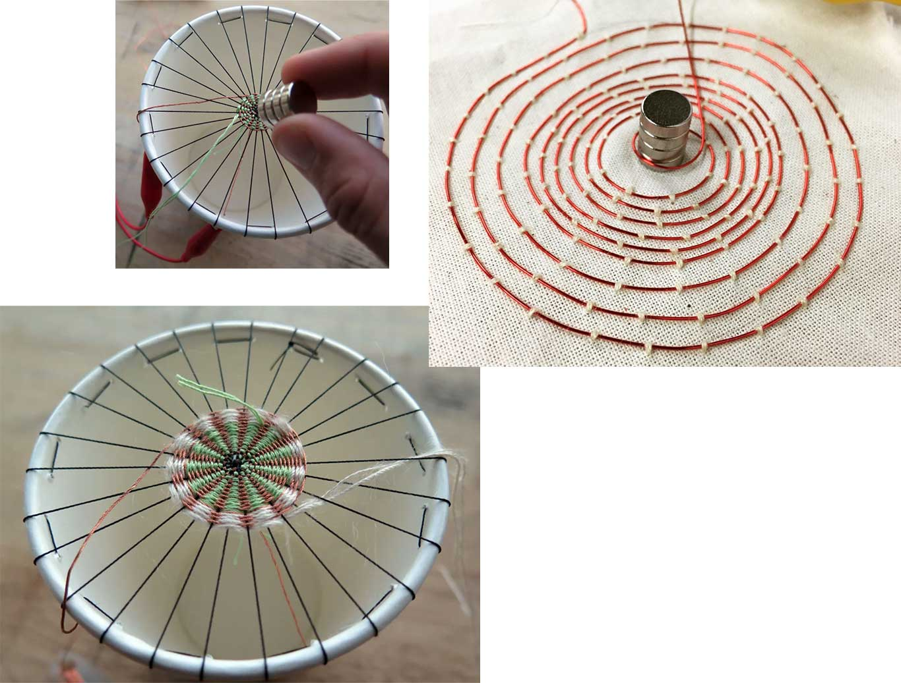 
 
 *Credit: Kobakant*

 
### Amplifier 

You can get louder sound out of these devices with an additional amplifier, E.g. **Velleman PMK190** €10,50 [via Soldeerboutshop](https://www.soldeerbout-shop.nl/zelfbouw-kits/390-velleman-mk190-mp3-speler-audio-versterker-2x-5watt-mini-kits-bouwpakket-5410329450168.html) or [via Display Elektronica](https://display-elektronica.nl/Webwinkel-Product-201167391/MK190-2X5W-VERSTERKER-VOOR-MP3-SPELER.html)

*Note: this amp has a 3.5mm jack chassis for audio in (so you need a solderable jack plug to connect it).*

For wiring diagram is see here [./files > ISD1820_wiring.pptx](./files/ISD1820_wiring.pptx)

 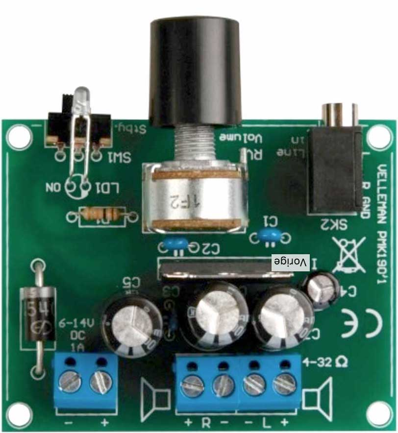 
 
 
## Triggers: switches and sensors

You can make your digital sensor or use already made digital sensors. The options below are plug and play without coding or breadboard (just jumpers/alligator clips). The pre-assembled boards allow you to calibrate an analog sensor as switch (e.g. light sensor), by turning the screw on the board. You can also use any on/off switches you salvage from old devices and use them as a trigger

### any metal/conductive parts 

Aluminum foil, copper tape, metals, wet materials. See also this page with examples: [DIY switches page](./switches/diyswitches.md)

 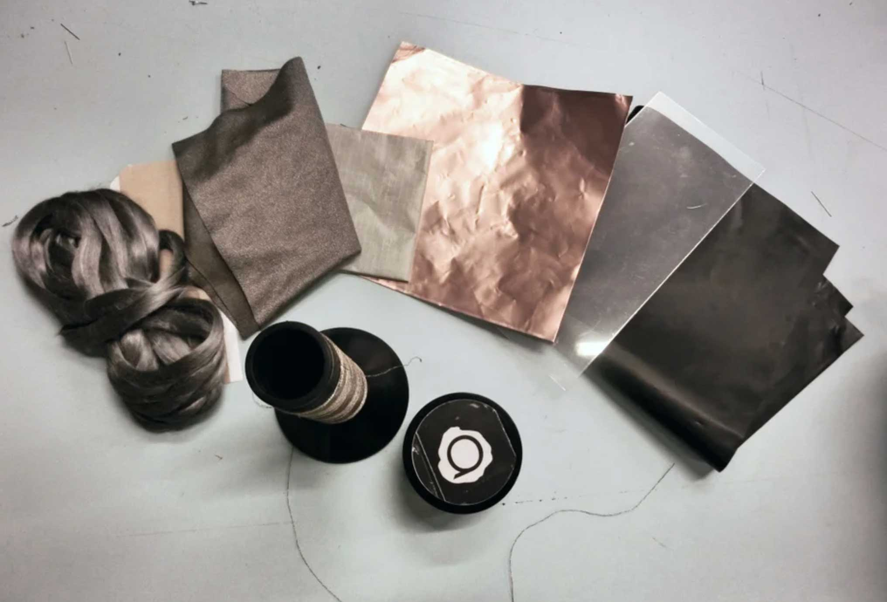 

### piezo transducer 

€0.50 [via tinytronics](https://www.tinytronics.nl/shop/en/audio/speakers/buzzers/piezo-electronic-buzzer-with-soldered-wires-35mm) press, knock or bend to create trigger signal.

  

### vibration sensor module 

€ 2 [via tinytronics](https://www.tinytronics.nl/shop/en/sensors/acceleration-rotation/vibration-sensor-module-3-5v-sw-18010p)

 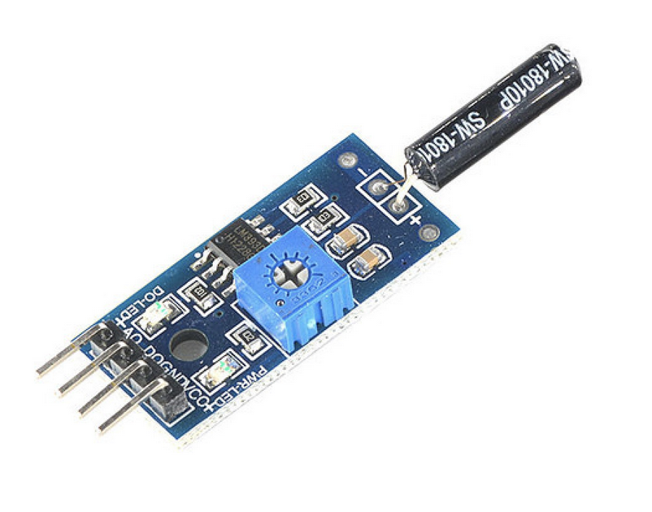 

### tilt sensor 

€ 2 [via tinytronics](https://www.tinytronics.nl/shop/en/sensors/acceleration-rotation/ball-switch-tilt-sensor-module-3-5v-sw-520d)

 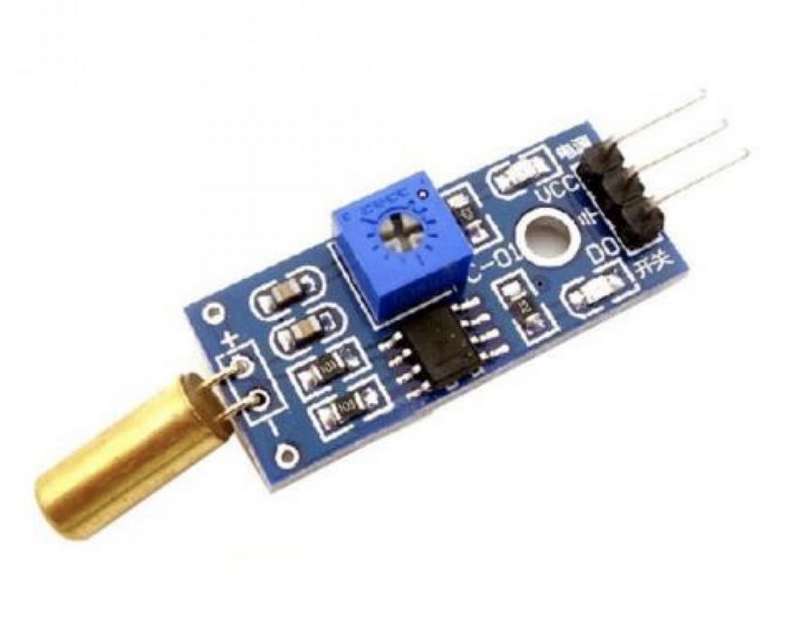 

### magnet sensor 

€ 1,50 [via tinytronics](https://www.tinytronics.nl/shop/en/sensors/magnetic-field/hall-effect-switch-module)

 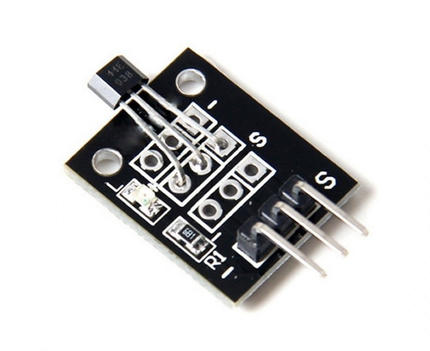 

### motion sensor 

€ 3,50 [via tinytronics](https://www.tinytronics.nl/shop/en/sensors/motion/ir-pyroelectric-infrared-pir-motion-sensing-detector-module)

>> can be hard to control, bit flimsy

  

### light sensor 

€ 2,50 [via tinytronics](https://www.tinytronics.nl/shop/en/sensors/optical/light-and-color/light-sensor-module)

 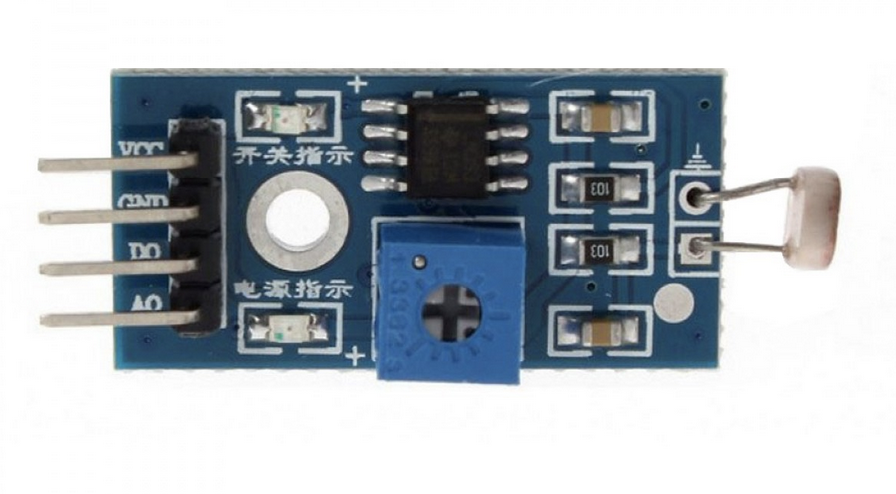 

### red laser sensor 

€ 2 [via tinytronics](https://www.tinytronics.nl/shop/en/sensors/
optical/light-and-color/red-laser-sensor-module)

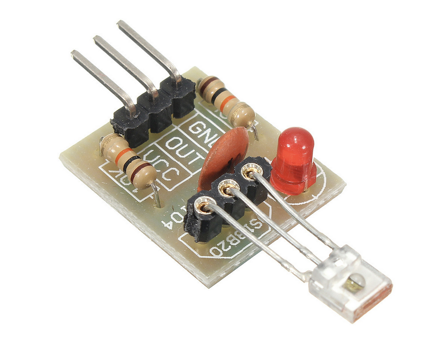 

## Output: Other than sound

WIP

### Piezo mist discs 

€ 0,80 standalone, [via tinytronics](https://www.tinytronics.nl/shop/en/mechanics-and-actuators/others/piezo-mist-disc-110khz) or module € 4 [via tinytronics](https://www.tinytronics.nl/shop/en/mechanics-and-actuators/others/ultrasonic-mist-module)

 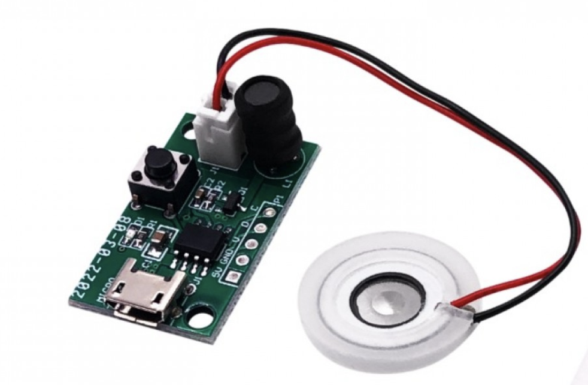 

### red laser 

€ 2 [via tinytronics](https://www.tinytronics.nl/shop/en/sensors/optical/light-and-color/red-laser-sensor-module) >> omg check [this DIY laser projection generated by sound and mirrors](https://www.kobakant.at/DIY/?p=9106)

 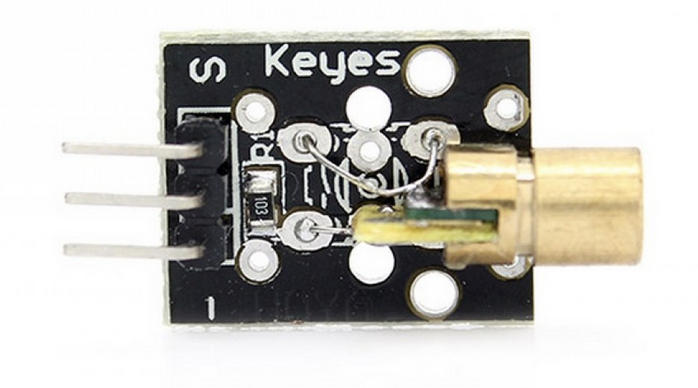 
 

## Messaging: walkie talkies

Now ordered these walkie talkies to open up, € 29.99 [via LIDL](https://www.lidl.nl/p/silvercrest-walkie-talkies-voor-kinderen/p100359077002?mktc=shopping)

These have 8 channels to choose from, volume control, and - yess - a mic. Sound quality is not bad! Also has an LED number panel that indicates the selected channel. The channels probably mean we can also have more than 2 walkie talkies transmitting on that frequency. 

Opens up by loosening the screws, just need to cut into silicone that glues down the speaker to remove it. Circles in the PCB show where the buttons were located. Other switches can be attached with some precision soldering and a dot of hot glue.

**Can be customized?**

* switches > YES
* microphone > YES
* LED number > only externally I think? E.g. make a lamp cover LOL
* speaker > YES
* 4.5V power supply > also ok at 5V?
	* **250mA when receiving** (bench supply stays at 5V) [see video](./files/receive.mp4)
	* **400mA when sending!** (my bench supply drops to 4.5V) [see video](./files/send.mp4)

 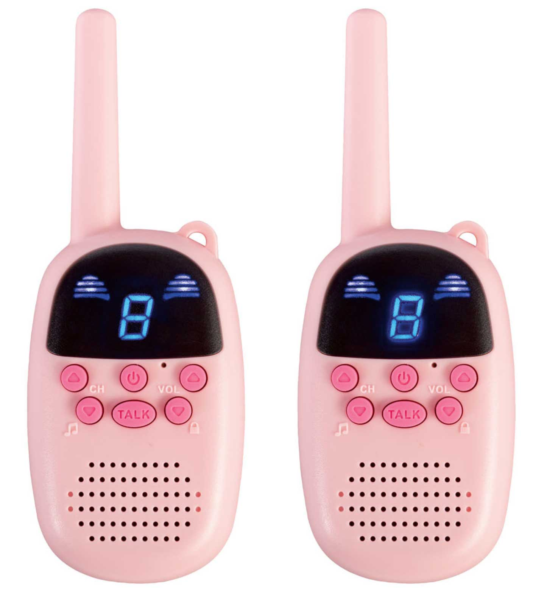 

 *walkie talkies unharmed*

  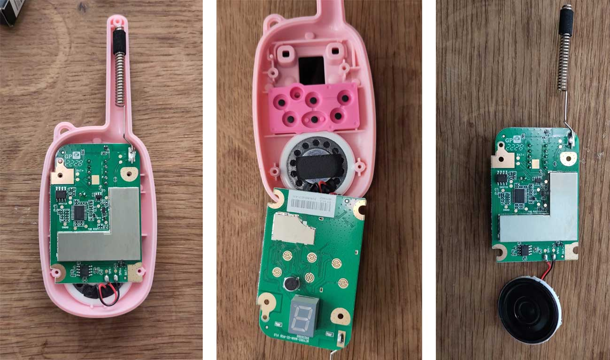 
 
 *opening up walkie talkie: carefully cut loose silicon that keeps speaker in place*

  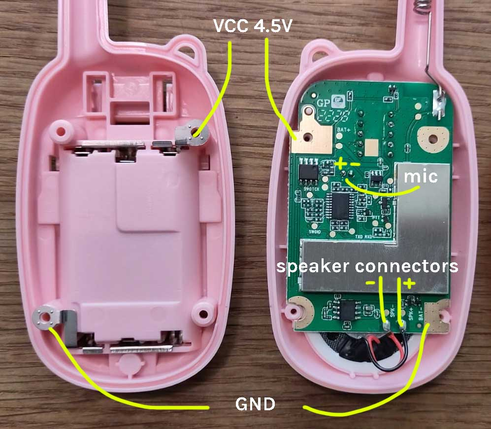 

   *power connections and speaker connector*
  
  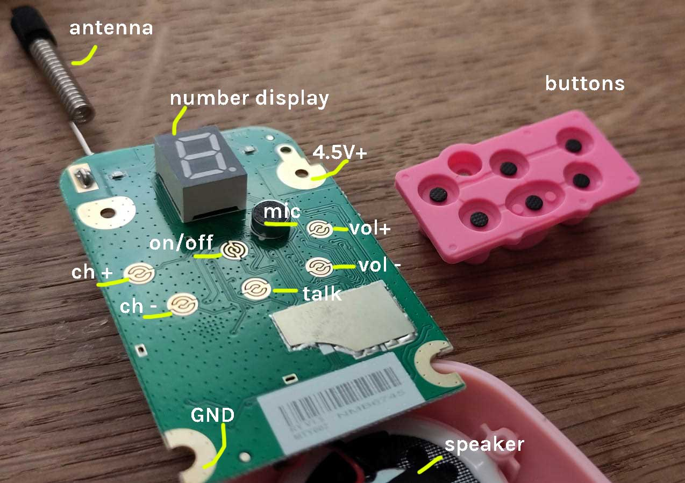 

   *switches and other components on reverse*
   
**Soldering leads to the button connectors**

This took me an hour and a half, it's quire a surgeon's job. But it still works! How I did it: 

* soldering tip: small tip with a flat edge
* keep desoldering braid at hand for mistakes
* use insulation tape as masking tape, so only the part you want to solder is free
* put a teeny tiny drop of solder where you want to connect the jumper
* strip 1 cm of your wire
* take two strands from the jumper wire, cut the rest short
* twist the two strands and tin them with solder
* cut them down to 3-4 mm (don't do as I did in the pics! you will short stuff)
* solder the two copper hairs to the pad
* do the same with the other part of the switch
* check with the multimeter if the wires are properly connected and not shorted
* keep in place with a dollop of hot glue
* tape the wire pairs for each switch together with tape, for easy reference

	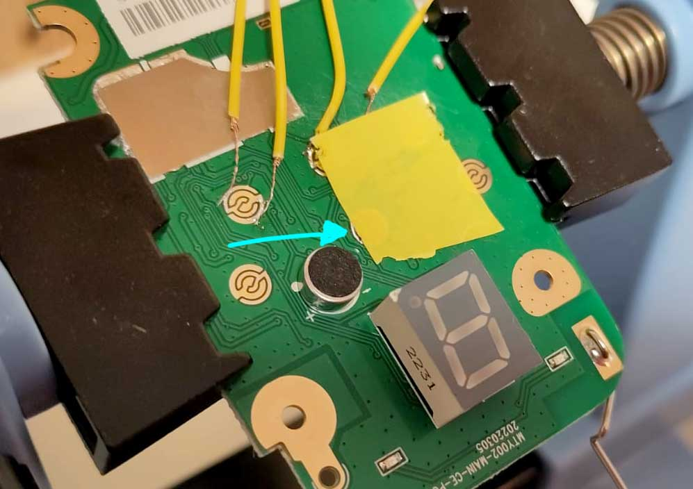 

	*masked the traces so only the tiny part to solder is naked*

	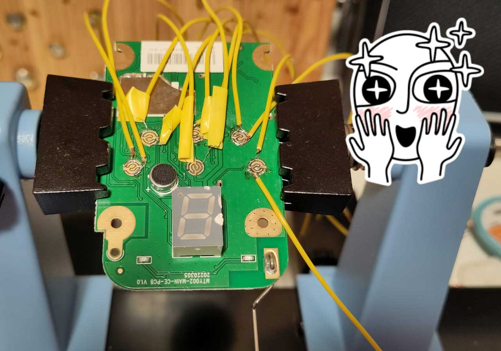 

	*very proud, this was harrrrd*
	
	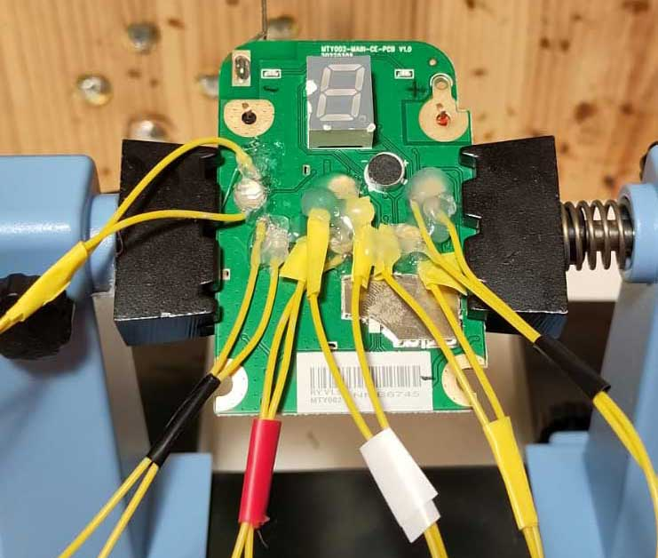 
	
	*wasn't too stingy with the hotglue, but had to be careful not to break wires*

* Earlier I got these €10 walkie talkies from flying tiger. **These don't actually have a microphone!** They just pick up noise and interference (so can work as noise making devices). Listen [here](./files/walkienoise.mp3). Available at [flying tiger €10](https://flyingtiger.com/nl/products/walkie-talkie-set-3034395?variant=41188458397894&srsltid=Ad5pg_E7P2uBBKjFlA-3Iy8jgljKbblaxprOBdHRD30Sq0cDsXl1De_tzrs&currency=eur)

 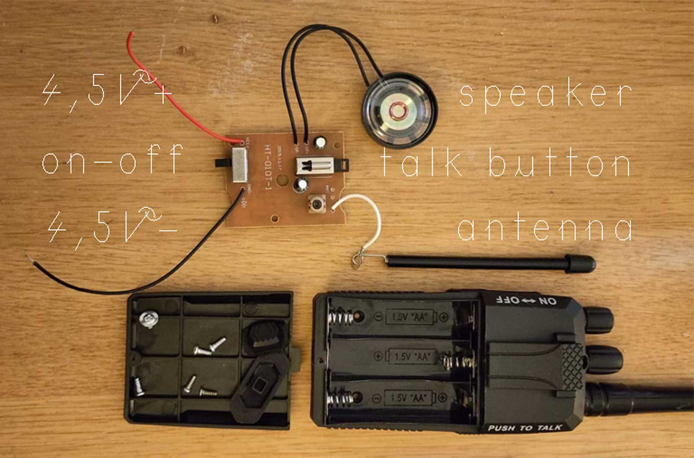 

 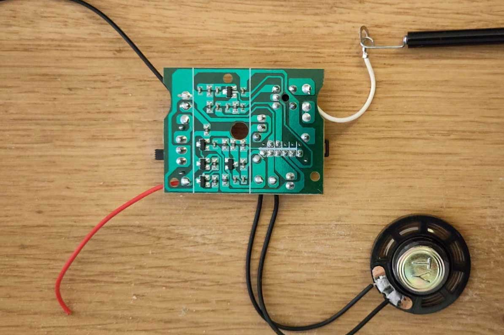 

## Power supplies

**WIP** 

### Solar powered

>> We have a bunch of these kits from another solar project. Could be worth checking out for this workshop? 

* LilyGO TTGO T-Bat w 18650 Li-on battery holder CN3065 € 5,50 [via Tinytronics](https://www.tinytronics.nl/shop/nl/power/bms-en-laders/li-ion-en-li-po/met-protectiecircuit/lilygo-ttgo-t-bat-met-18650-batterijhouder-cn3065)
	* Vin: 5V (via micro USB connector) OR 4.5-6V via solar cell connector OR solar cell via JST connector
	* Vout: 5V via USB A connector or via JST-PH connector
* Li-on 18650 battery 3400mA - 10A - € 6,00 [Via tinytronics](https://www.tinytronics.nl/shop/nl/power/batterijen/18650/lg-18650-li-ion-batterij-3400mah-10a-inr18650-mj1)
* Seeed Studio Solar panels 5.5V 100mA - 55x70mm with JST-PH connector €4,25 [via Tinytronics](https://www.tinytronics.nl/shop/nl/power/zonne-energie/zonnepanelen/seeed-studio-zonnepaneel-5.5v-100ma-55x70mm-met-jst-ph-connector). Also available: 5.5V 170mA but has bulkier size [via tinytronics, €6,50](https://www.tinytronics.nl/shop/nl/power/zonne-energie/zonnepanelen/seeed-studio-zonnepaneel-5.5v-170ma-80x100mm-met-jst-ph-connector)

 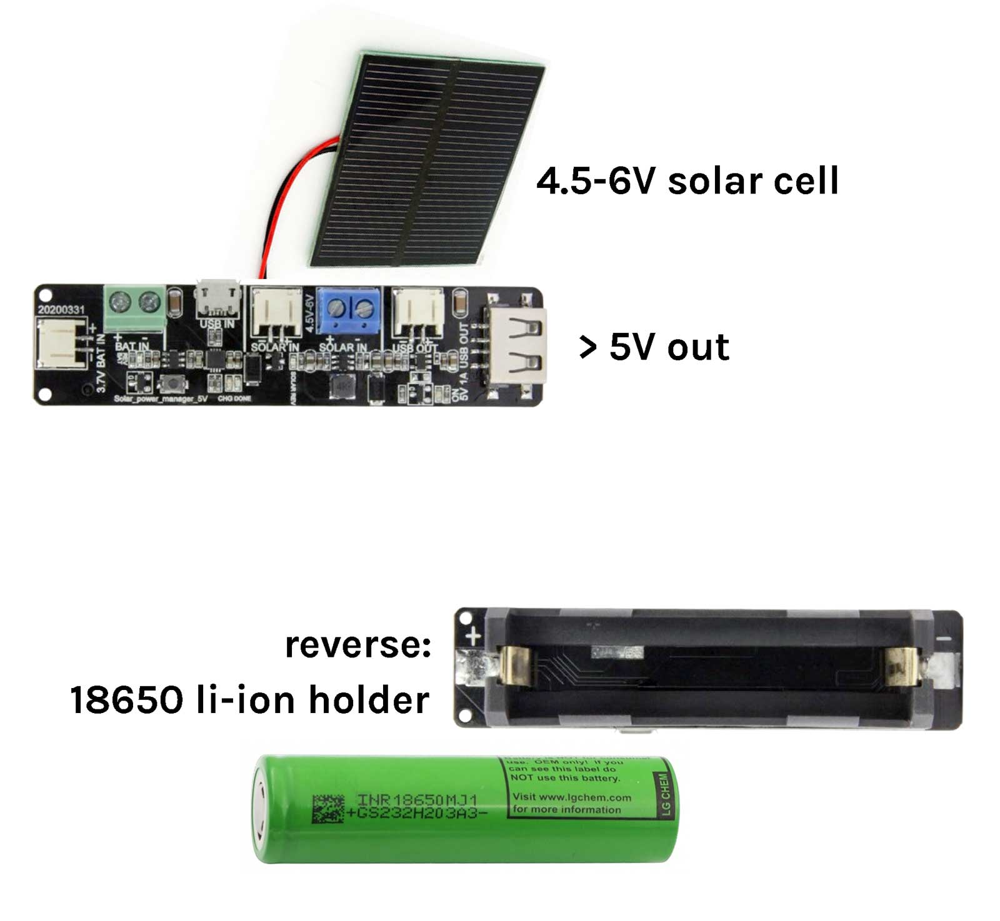 

### Solar panels test
 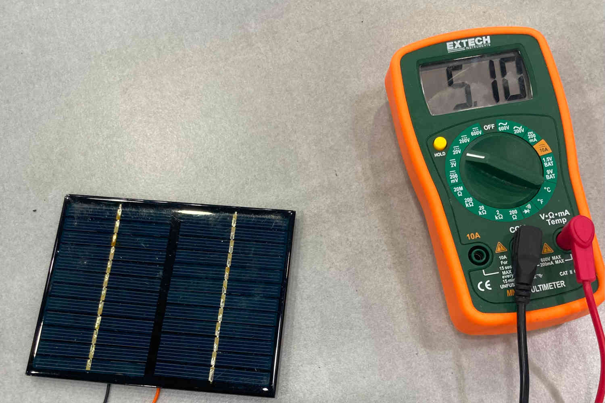
  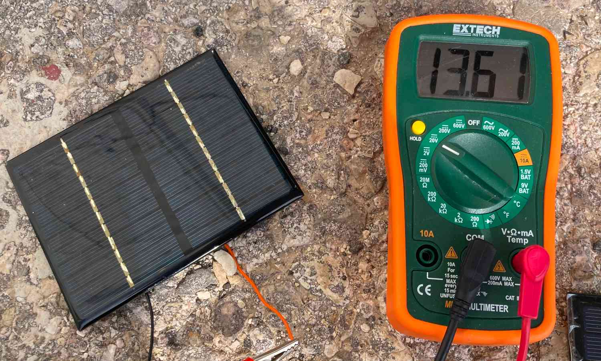
   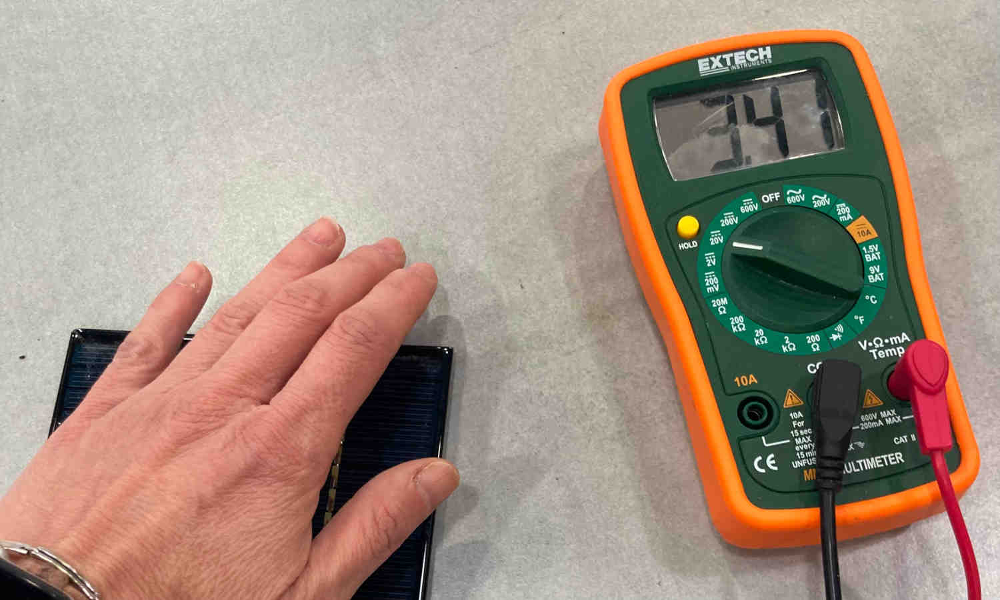
    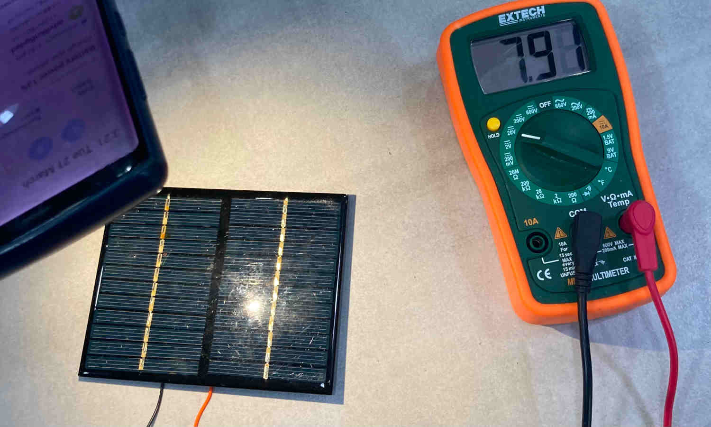
  
with the use of a DC-DC converter, € 3 [via TinyTronics](https://www.tinytronics.nl/shop/en/power/voltage-converters/buck-(step-down)-converters/dc-dc-ajustable-step-down-buck-converter-lm2596-3a), you can power directly the board, without battery.

>> Video to understand boost and buck converters and how to calculate : [https://youtu.be/9--_jaxiXhE](https://youtu.be/9--_jaxiXhE)

>> Datasheet of LM2596 chip on the buck converter above [./datasheets/LM2596chip-on-buck-conv.pdf](./datasheets/LM2596chip-on-buck-conv.pdf) 

>> From what I understand if the Vin from the solar cell drops too low (<4V) this could blow the circuit because it will draw too much current? 

>> The datasheet mentions the option of an undervoltage lockout circuit but i can't tell if the module tinytronics sells has this or whether we can add it on. Undervoltage lockout monitors Vin: if it's too low it will not switch on, only when its high enough?

**Solar readings**

For Seeed Studio Solar panels 5.5V 100mA - 55x70mm with JST-PH connector €4,25 [via Tinytronics](https://www.tinytronics.nl/shop/nl/power/zonne-energie/zonnepanelen/seeed-studio-zonnepaneel-5.5v-100ma-55x70mm-met-jst-ph-connector)

I didn't try outside on a sunny day yet (it hasn't been sunny). As single cell I don't think these will do eh? Need something that outputs >5V in dark-ish conditions I guess? Maybe more like this? [https://www.tinytronics.nl/shop/en/power/solar-energy/solar-panels/solar-panel-with-dc-dc-converter-and-usb-5v-1a](https://www.tinytronics.nl/shop/en/power/solar-energy/solar-panels/solar-panel-with-dc-dc-converter-and-usb-5v-1a)

* Dark corner inside: 1.25V
* Inside the house during day: 2.2V
* Covered w hand in the window: 2.35V
* Dark corner, with LED light: 3.8V
* In the window (overcast day): 4.9V
* Outside in the sun: ??

 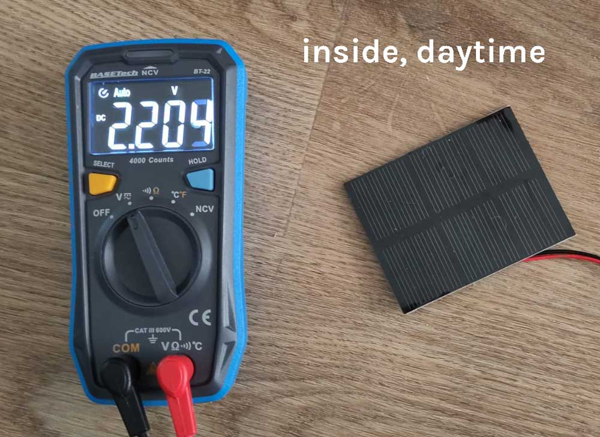
 
  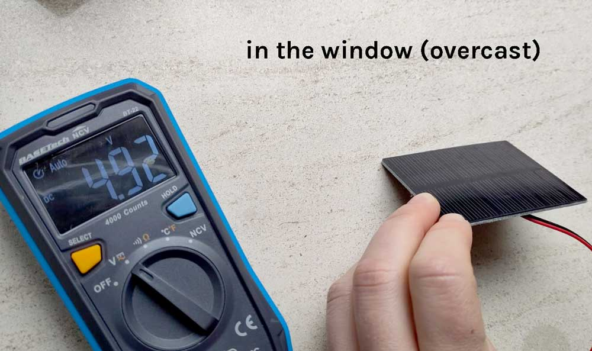

  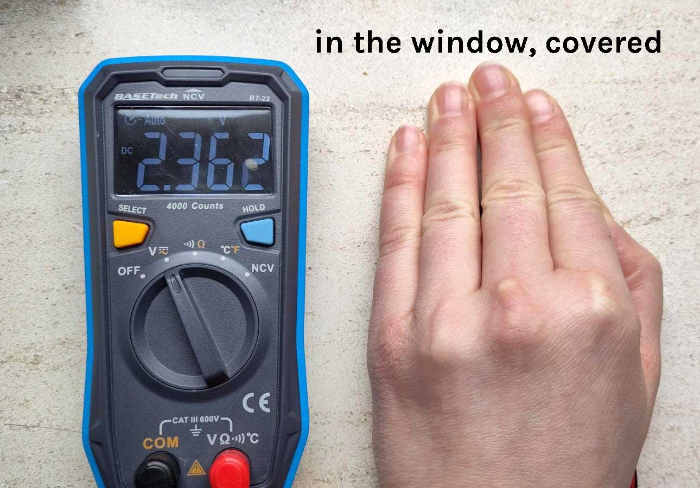
  
   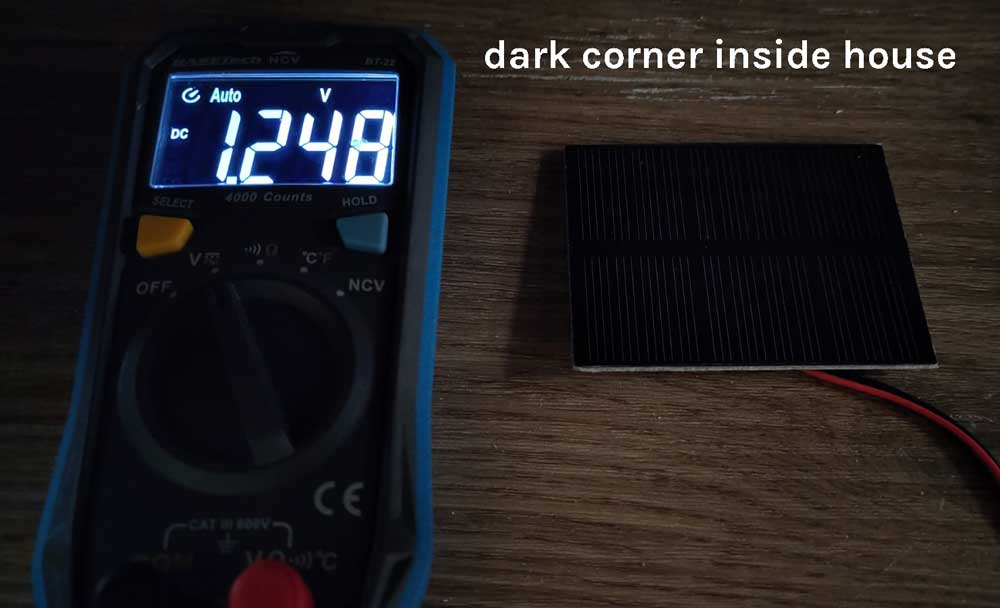

  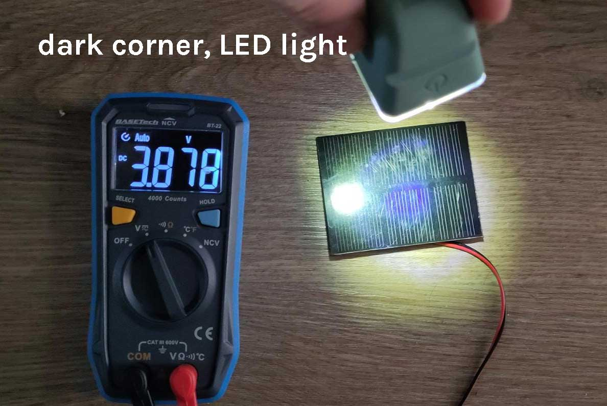

**Alternative solar cells**

I found two interesting options at reichelt. The first one has a lower voltage but higher current, so suitable for running motors and prob also speakers if we connect 3 in series:  

* 2V, 380 mA [Solar SM2380 via Reichelt](https://www.reichelt.nl/nl/nl/vergoten-zonnecel-2-v-380-ma-solar-sm2380-p159957.html?&nbc=1)
* 6V, 150 mA [Solar SM6150 via Reichelt](https://www.reichelt.nl/nl/nl/vergoten-zonnecel-6-v-150-ma-solar-sm6150-p159960.html?&nbc=1)

### DYNAMO powered

instructable: [https://waag.org/sites/waag/files/en-ditos-10-phone-lr.pdf](https://waag.org/sites/waag/files/en-ditos-10-phone-lr.pdf)

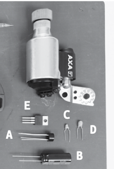
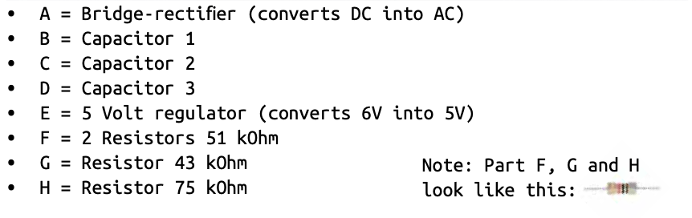
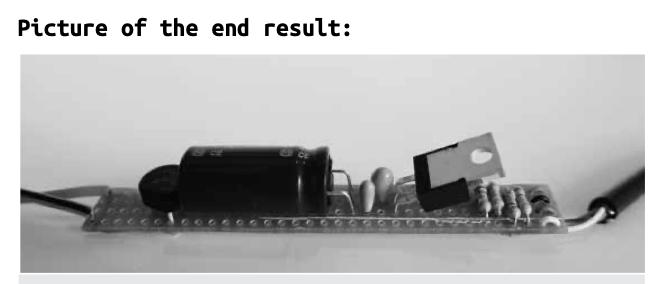
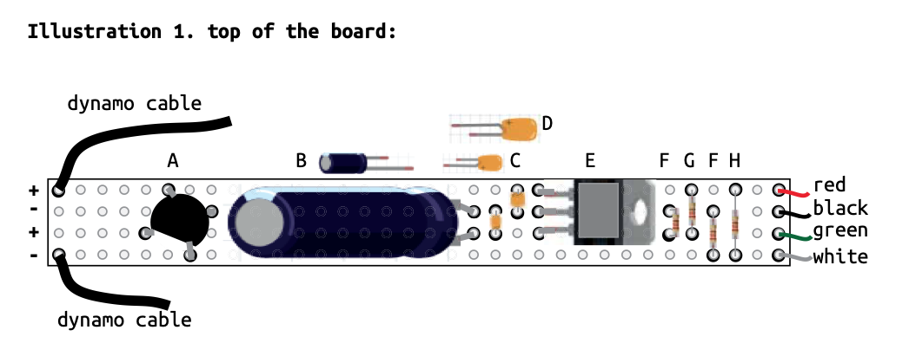
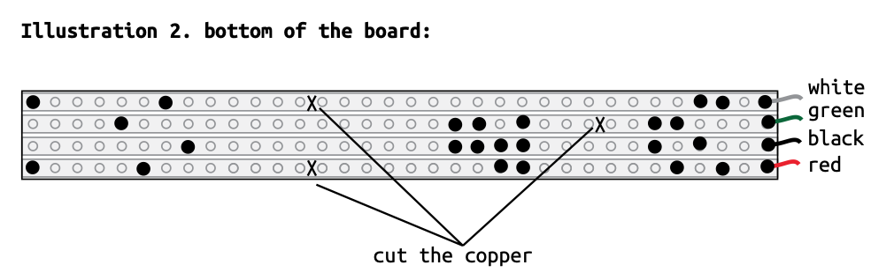

**Materials for DIY dynamo**

* 6V dynamo at [Praxis](https://www.praxis.nl/tuin-buitenleven/fiets/fietsverlichting/dresco-dynamo-links-zwart-6v-3w/5599378?channable=02490e69640035353939333738d6#specs) €4 

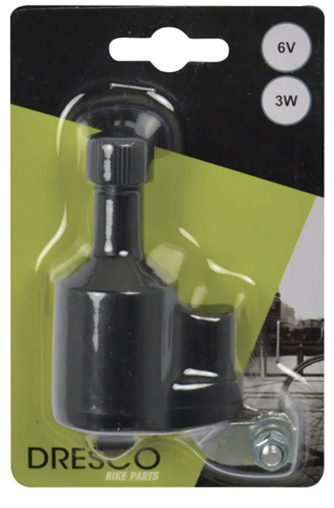

**Parts list for use with 6V/12V/24V (up to 26V) dynamos**

* Bridge rectifier (AC to DC) = [AM151](https://uk.farnell.com/multicomp/am151/bridge-rectifier-1-5a-100v/dp/9381430) or alternative [via Reichelt](https://www.reichelt.nl/nl/nl/bruggelijkrichter-400-v-1-5-a-b250c1500g-vis-p219410.html?&trstct=pol_11&nbc=1)
* Capacitor 1 = 2200uF electrolytic [via Reichelt](https://www.reichelt.nl/nl/nl/elko-radiaal-2200-f-25-v-105-c-16-x-25-mm-rm-7-5-muniti-rad-105-2-200-25-p42407.html?&trstct=pol_0&nbc=1)
* Capacitor 2 = 0.47uF tantalum [via Reichelt](https://www.reichelt.nl/nl/nl/tantaal-condensator-rm-2-5-0-47-f-35v-tantal-0-47-35-p20328.html?&nbc=1)
* Capacitor 3 = 22uF tantalum [via Reichelt](https://www.reichelt.nl/nl/nl/tantalkondensator-22-f-35-v-avx-tap226m035cc-p246462.html?&nbc=1)
* 5V regulator (converts 6V into 5V) [LM2940CT5 via Reichelt](https://www.reichelt.nl/nl/nl/spanningsregelaar-5-0v-1a-to-220-lm-2940-ct5-p39455.html?&nbc=1) But you are on the limit! Actually they recomend voltage inpit 7V. This regulator can be used also with a 12V dynamo.
* 2x resistor 51 ohm [via Reichelt](https://www.reichelt.nl/nl/nl/koolstoffilmweerstand-1-4w-5-51-ohm-1-4w-51-p1441.html?&trstct=pol_0&nbc=1)
* 1x resistor 43 ohm [via Reichelt](https://www.reichelt.nl/nl/nl/koolstoffilmweerstand-1-4w-5-43-ohm-1-4w-43-p1427.html?&trstct=pol_0&nbc=1)
* 1x resistor 75 ohm [via Reichelt](https://www.reichelt.nl/nl/nl/koolstoffilmweerstand-1-4w-5-75-ohm-1-4w-75-p1466.html?&trstct=pol_0&nbc=1)
* perfboard lanes [via Reichelt](https://www.reichelt.nl/nl/nl/bandroosterprintplaat-hardpapier-160x100mm-up-720hp-p23958.html?&nbc=1)

**@ EMMA: I've tried making a schematic and breadboarded version from the example and your info for the 6V/12V/24V option. I hope the color codes make legible a bit the thinking process. If you want to check the fritz for proper routing, the fritzing sketch is under Files > dynamo_v2_noresistors.fzz. _UPDATE_: I removed the resistors and made a version without bridge rectifier for the solar powered version.**

[OR just get experiment PCB lanes (continuous) at tinytronics €2 a pop](https://www.tinytronics.nl/shop/en/tools-and-mounting/prototyping-supplies/experiment-pcbs/experiment-pcb-9cm*15cm-lanes)

  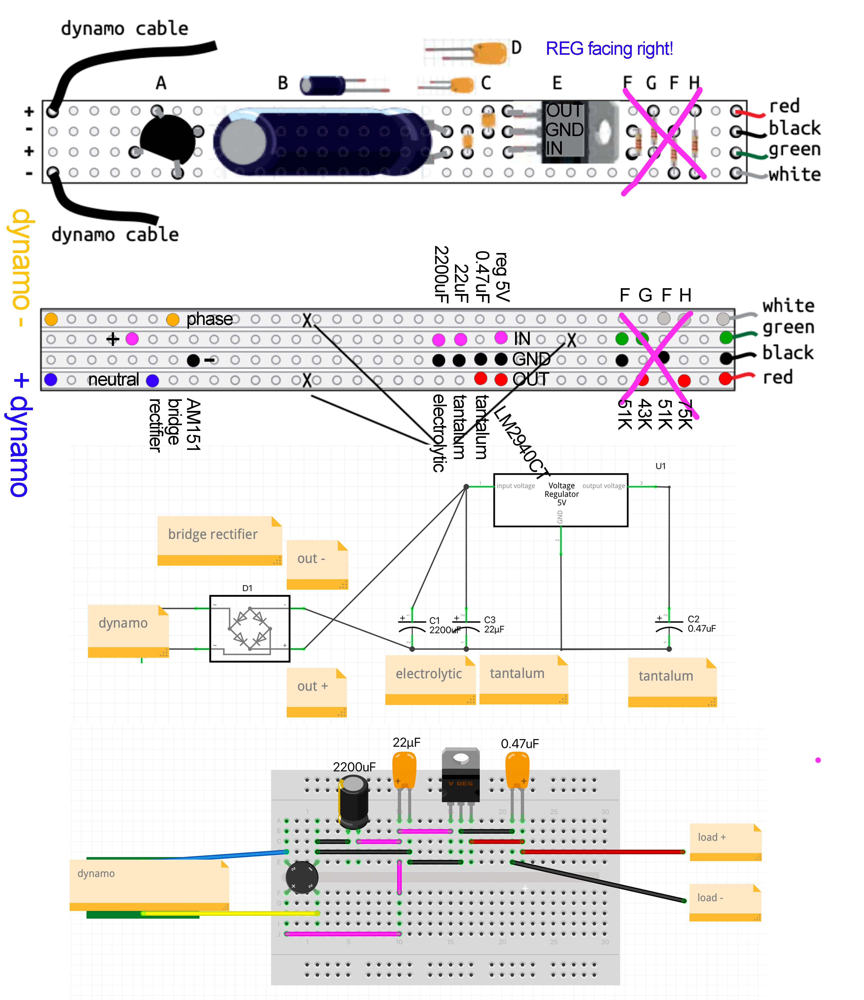
  
**Alternative: (only with 6V dynamos)**

* 5V output regulator, at least current from 0.5 up to 1.5A: the only one through hole I found in Fernel is MCP1826S-5002E/AB: [link](https://it.farnell.com/en-IT/microchip/mcp1826s-5002e-ab/ic-ldo-5-0v-1a-to-220-3/dp/1578425)
* Capacitor 3 (on output): 10uF (tantalum cap, orientation!)
* Capacitor 2 (on input): 4.7uF (Tantalum cap, orientation!)

  
### Solar powered variation

The same circuit can be used with solar cells in series (totalling > 5V!) instead of a dynamo. This one assumes 3x the 2V/380mA solar cells, in series they would supply 6V/380mA. Let's see if this can power the different outputs. Otherwise a formation of 3x2 for 6V/760mA seems to be suitable, but a little bulky (6 cells).

  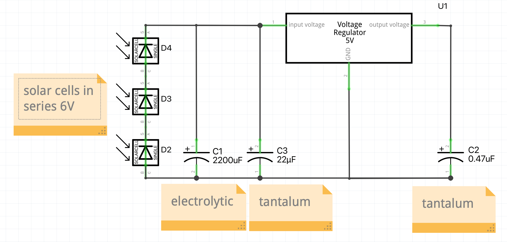

  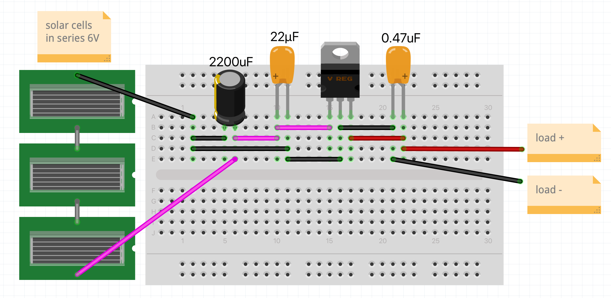

  
## Casing and integration

WIP
