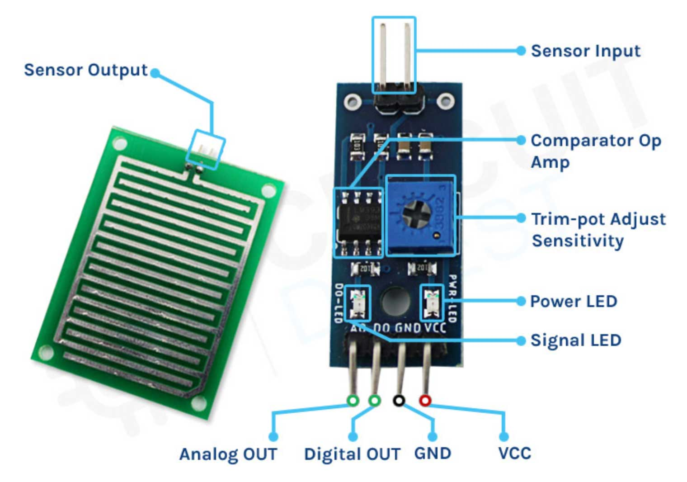
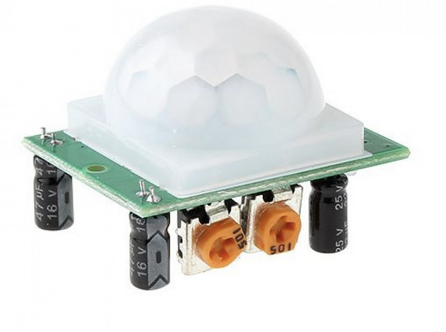
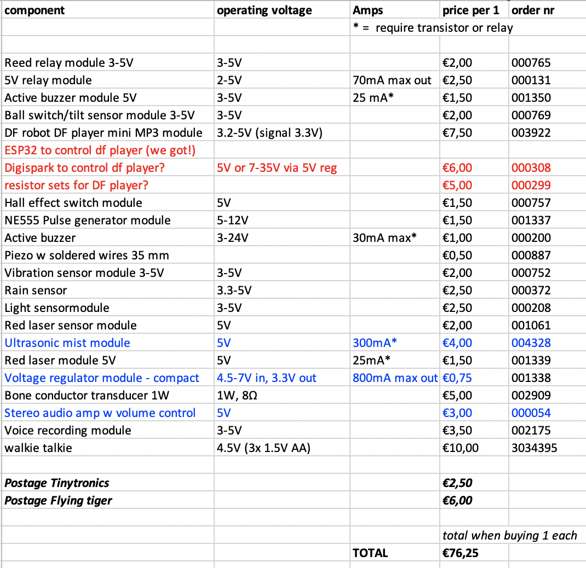

# Age of Dust

Research for age of dust tools as part of worldbuilding.

## Wishes

* record and playback audio
* freedom in designing the interaction with the tool and how it looks
* possibility to recycle hardware parts
* walkie-talkie-like system could be fun

## Questions for Juliette

* do you think we'd need to be able to hook up audo devices to pro sound system? Or a little simpler: a small battery powered speaker. Or on the lower end: 4-8 ohm lil speakers.
* how many participants are we thinking?
* are there any tools you imagine you'd want more than one of? 
* options are now no-coding (easy for all), some options that require coding also ok?
* it could be cool to go [soft](https://www.kobakant.at/DIY/) (wearable props), but this is an entirely different making process. Could also be wearable but hard :)
* What kind of materials would you prefer for casings? Natural materials? Plastics? Recycled? Integrated into costume?

## Budget

Max € 750 for all materials, components, tools

## Workflow

* Research some options to make sure things work together, based on wishes
* Document some examples for participants on how things work/connect
* The actual exploration - building tools for the script - will happen in the workshop

## No-coding tool options

### Input: Audio recording & playback

#### MP3 player €7.50

You can play the audio tracks saved in an SD card. You can trigger the different tracks by attaching switches/buttons to the different pins. You can customize the button and the speakers. See below.

[Via tinytronics](https://www.tinytronics.nl/shop/en/audio/audio-sources/dfrobot-dfplayer-mini-mp3-module)

[Documentation](https://wiki.dfrobot.com/DFPlayer_Mini_SKU_DFR0299)

Upside:

* can be triggered w resistors + switch combos, no microcontroller
* can be controlled via UART (e.g. Arduino UNO, but have also seen [examples with ESP32](https://youtu.be/kq2RLz65_w0), which we have few of at H&D? Looked into ATtiny85 digispark a bit, [could work](https://github.com/wagiminator/ATtiny85-TinyDFPlayer) with some tuning of the internal oscillator, but not super easy I guess.

Downside: 

* not typical values so need to do series of several resistors, not super stable it seems you need exactly the right value. I could make some pins work, but not all. Maybe a few is enough.
* controlling via ESP32 requires coding, but if we figure our how should be a huge problem to include. Some ppl will enjoy having the possibility of playing with a microcontroller as well if well-documented :) 

  

  

#### ISD1820 Voice recording module

ISD1820 - 20 second audio recording and playback module € 3.50 

[Via tinytronics](https://www.tinytronics.nl/shop/en/audio/accessories/others/voice-recording-module-with-speaker-isd1820)

[Datasheet](./files/VoiceRecord_moduleISD1820.pdf)

  

ISD1820 Voice Recording and Playback Module is made of  different elements, not all of them can be customized:

**Can NOT be customized:**

* core pcb

**Can maybe be customized:**

* embedded mic

**Can be customized:**

* the speaker
* the buttons

**Modifications that can be done with jumper wires:**

* drive speaker directly
* play record on loop

Downside: 

* Only one file can be stored and played on this device.

### Audio: Speakers

* normal speakers (anything that takes a 3.5mm jack)

  

* soft speakers, a little bit elaborated, you need different materials [see Kobakant](https://www.kobakant.at/DIY/?p=5935)

* piezo transducer €0.50 [via tinytronics](https://www.tinytronics.nl/shop/en/audio/speakers/buzzers/piezo-electronic-buzzer-with-soldered-wires-35mm) placing it between teeth or on jaw makes sound audible

  

* bone conductor transducer, turns any surface into a speaker € 5 [via tinytronics](https://www.tinytronics.nl/shop/en/audio/speakers/speakers/bone-conductor-transducer-8%CF%89-1w), [via Adafruit](https://www.instructables.com/Adafruit-Bone-Conduction-Speaker/)

  
 
* stereo amplifier 2x3W 5V w volume control € 3 [via tinytronics](https://www.tinytronics.nl/shop/en/audio/amplifiers/2x3w-stereo-audio-amplifier-mini-5v-pam8403-volume-control-v2)

  

### Triggers: switches and sensors

You can make your digital sensor or use already made digital sensors. The options below are plug and play without coding or breadboard (just jumpers/alligator clips). The pre-assembled boards allow you to calibrate an analog sensor as switch (e.g. light sensor), by turning the screw on the board. You can also use any on/off switches you salvage from old devices and use them as a trigger

* any metal/conductive parts (aluminum foil, copper tape, metals, wet materials). See also this page with examples: [DIY switches page](./switches/diyswitches.md)

  

* vibration sensor module - € 2 [via tinytronics](https://www.tinytronics.nl/shop/en/sensors/acceleration-rotation/vibration-sensor-module-3-5v-sw-18010p)

  

* tilt sensor € 2 [via tinytronics](https://www.tinytronics.nl/shop/en/sensors/acceleration-rotation/ball-switch-tilt-sensor-module-3-5v-sw-520d)

  

* water sensor € 2,50 [via tinytronics](https://www.tinytronics.nl/shop/en/sensors/liquid/rain-sensor)

  

* magnet sensor € 1,50 [via tinytronics](https://www.tinytronics.nl/shop/en/sensors/magnetic-field/hall-effect-switch-module)

  

* motion sensor € 3,50 [via tinytronics](https://www.tinytronics.nl/shop/en/sensors/motion/ir-pyroelectric-infrared-pir-motion-sensing-detector-module)

  

* light sensor € 2,50 [via tinytronics](https://www.tinytronics.nl/shop/en/sensors/optical/light-and-color/light-sensor-module)

  

* red laser sensor € 2 [via tinytronics](https://www.tinytronics.nl/shop/en/sensors/
optical/light-and-color/red-laser-sensor-module)

 

### Output: Other than sound

* Piezo mist discs € 0,80 standalone, [via tinytronics](https://www.tinytronics.nl/shop/en/mechanics-and-actuators/others/piezo-mist-disc-110khz) or module € 4 [via tinytronics](https://www.tinytronics.nl/shop/en/mechanics-and-actuators/others/ultrasonic-mist-module)

  

* red laser € 2 [via tinytronics](https://www.tinytronics.nl/shop/en/sensors/optical/light-and-color/red-laser-sensor-module) >> omg check [this DIY laser projection generated by sound and mirrors](https://www.kobakant.at/DIY/?p=9106)

  
 

### Messaging: walkie talkies

* Now ordered these walkie talkies to open up, € 29.99 [via LIDL](https://www.lidl.nl/p/silvercrest-walkie-talkies-voor-kinderen/p100359077002?mktc=shopping)

  

* Earlier I got these €10 walkie talkies from flying tiger. **These don't actually have a microphone!** They just pick up noise and interference (so can work as noise making devices). Listen [here](./images/walkienoise.mp3). Available at [flying tiger €10](https://flyingtiger.com/nl/products/walkie-talkie-set-3034395?variant=41188458397894&srsltid=Ad5pg_E7P2uBBKjFlA-3Iy8jgljKbblaxprOBdHRD30Sq0cDsXl1De_tzrs&currency=eur)

  

  

### Power supplies

**WIP** 

Made a little overview of the list you sent @Emma. In red and blue some things I though tof that might be handy. An editable spreadsheet is in [here](./files/components.xlsx)

  

### Casing and integration

WIP