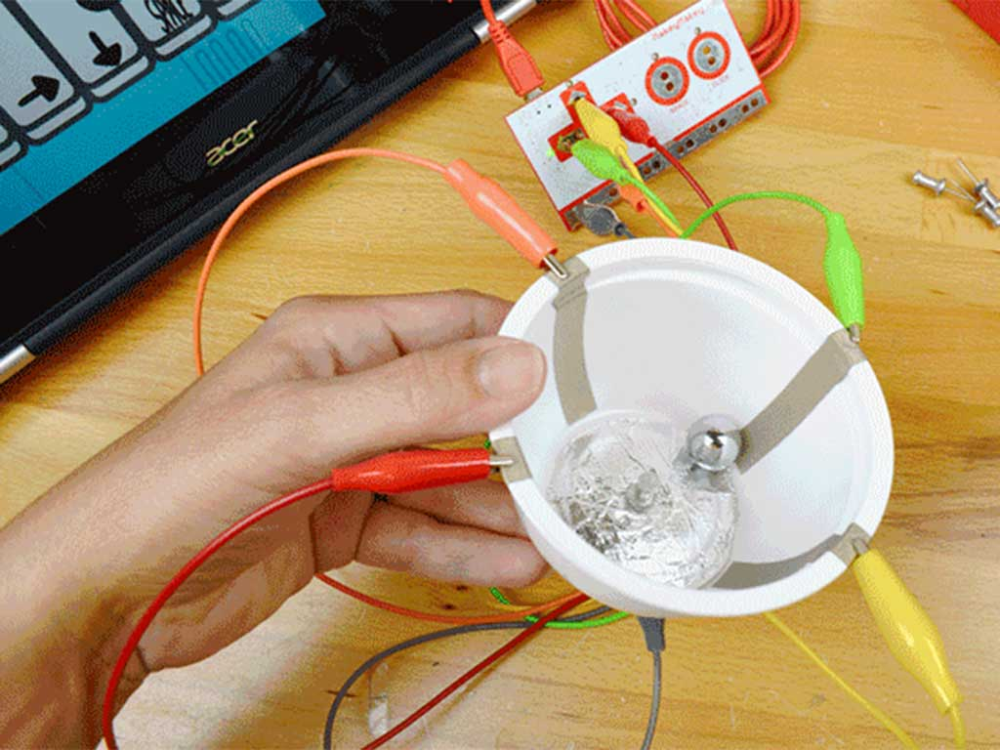
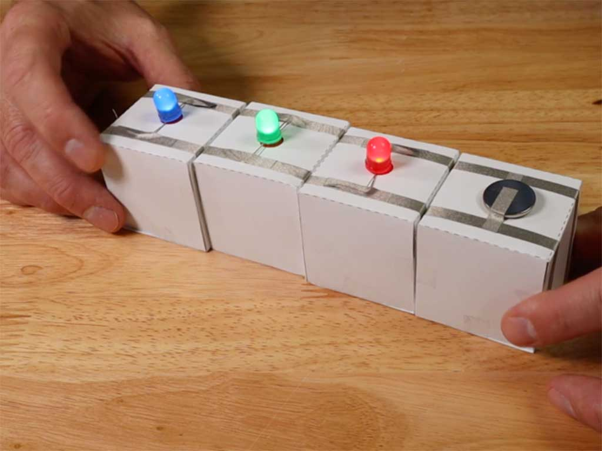
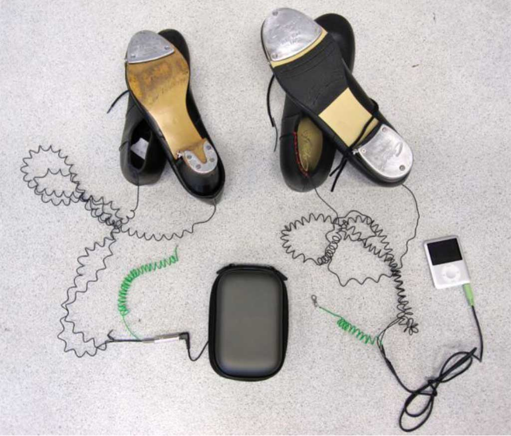

# Switches and triggers

## What is a switch?

There are many different switches, and they are all based on the same principle. When a  circuit is "open" or interrupted, there cannot be a circular flow of electrons. If you change something, the circuit is "closed" meaning there's a loop so electricity can flow, turning on the devices in the circuit. 

 

*Credit: [Electronics hub](https://www.electronicshub.org/switches/)*

Looking at schematic representations of electronic switches give you a basic idea of how they work. 

 
 
 

*Credit: [Electronics hub](https://www.electronicshub.org/switches/)*

## Triggers

The little modules are switches that are not manually controlled (e.g. by pressing a button with your finger), instead they are controlled by a contextual change. E.g. the light changes, the device is tilted, or senses the presence of a magnet. The modules contain multiple components such as an analog sensor, resistors, and a chip. As a whole, the module is created to *act as a switch*. When the device is manipulated, it sends out a HIGH signal (voltage in the circuit > 0V), which can trigger for example an audio file to play, or turn a light on. 

## DIY Switches

 

*Clockwise, starting bottom left: flick switch, bell switch, turning knob, pedal, tilt switch. Credit: Loes Bogers*

 

*Clockwise, starting bottom left: knife switch, tilt switch, clothespin switch, pressure switch, push switch, magic wand switch. Credit: [Michael Fricano II](https://makeymakey.com/blogs/blog/teacher-hacks-makey-makey-switch-idea-board-by-michael-fricano-ii)*

 

*Paper tilt switch. Credit: Loes Bogers*

 

*Flick switch (pushing the long tail closes circuit when it touches the coil). Credit: Geert Lens*

 

*Blowing against piece of loosely attached aluminum foil closes circuit (and a whistle tone plays). Credit: Berit Janssen*

 

*Paper tilt switch. Credit: Summer Danoe*

 

*Paper tilt switch. Credit: Summer Danoe*

 

*Push switch. Credit: Makey Makey*

 

*Tilt switch. /Credit: Makey Makey*

 

*Modular switch (several cubes can be pushed together to close the circuit) Credit: Pete Prodoehl (Brown Dog Gadgets)*

 

*Push switch making use of a paper fold). Credit: makerspacescom*

 
 

*Combined switch (metal of tap shoes 1 > wet rug > metal of tap shoes 2 hold the ground connection, and body of person 1 > body of person 2 are the switch: the close the circuit when their skin touches) Credit: Loes Bogers*
